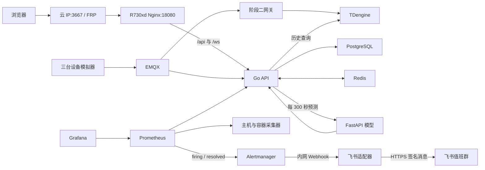

---
tags:
  - 源网智联
  - 运维
  - 二次开发
  - 开发阶段4
  - 开发阶段5
---

# 平台运维与二次开发手册 · 链路、源码与故障处理

> 本页面向接手服务器和源码的运维开发人员，解释网页功能背后的数据路径、关键文件、运行边界、排障方法和改动后的验证办法。网页与统一部署对应阶段四；第一版阶段五包含设备/AI 业务告警和平台监控通知。服务器命令以 [[stages/04-frontend/deploy/README.md]] 为准。

> **当前运维基线（2026-10-06）**：V2-M4候选为runtime/v2m4-20261005T180928Z/，问答调用保护、完整矩阵、安全、实际页面、回退、最终加密备份/隔离恢复及1800.52秒/60次观察通过，发布版本v2.0.0。知识缺口、来源哈希、审计与取消记录继续保存；专业审核、实际机型手册校对与知识补齐保持待办。正式结论见 [[第二版-智能体升级/开发阶段4-测试、安全复核与交付/05-V2-M4测试与交付]]。

## 一、系统边界与运行拓扑

目标环境运行在 R730xd 的 `/opt/powersystem`。`stages/04-frontend/deploy/compose.yaml` 统一编排 `emqx`、`tdengine`、`postgres`、`redis`、`ai-predict`、`gateway`、`api`、`simulator`、`frontend`、`node-exporter`、`prometheus`、`grafana`、`alertmanager` 和 `feishu-adapter`，第二版另加 `agent`。高权限 cAdvisor 已从项目部署移除；2026-10-06 服务器复核未见本项目 cAdvisor 容器。阶段二网关是唯一运行的写入网关，阶段一网关只保留作原阶段源码。



Nginx 仅绑定 R730xd `127.0.0.1:18080`；`frpc` 将它转发到云服务器 TCP `3667`，云端 Nginx 用可信 IP 证书在 `443` 提供 [HTTPS 入口](https://8.138.10.222/)，防火墙阻断 3667 外部直连。旧 HTTP 是 P0 历史入口。本项目 Prometheus 与 Grafana 只绑定 R730xd 回环地址 `19090`、`13000`，数据库、MQTT、AI 不映射公网。旧 Nginx 注册 403 与登录限速 429 有证据；第一版公网 HTTPS、续期和端口复验归入 [[第一版-平台主体/开发阶段6-公网安全与恢复能力/03-阶段六测试与交付]]。阶段五旧 API 故障监控群消息已确认，新设备及 AI 业务消息取得机器人 HTTP 成功响应，项目所有者确认群内可见。

## 二、源码从哪里读起

**前端与浏览器**

| 层 | 入口与关键文件 | 职责 |
| --- | --- | --- |
| Vue 页面 | `stages/04-frontend/src/router.ts`、`src/views/*.vue`、`src/layouts/ConsoleLayout.vue` | 路由守卫、登录/总览/设备/告警/预测页面与顶栏 |
| 浏览器数据层 | `src/lib/api.ts`、`auth.ts`、`realtime.ts`、`history.ts`、`format.ts`、`src/types.ts` | API 封装、会话、WebSocket、历史分段与抽稀、类型和格式 |
| 图表 | `src/components/TelemetryChart.vue` | ECharts 曲线展示 |

**服务端、预测与部署**

| 层 | 入口与关键文件 | 职责 |
| --- | --- | --- |
| Go HTTP | `stages/02-backend/internal/api/server.go`、`handlers.go`、`alarms.go`、`prediction.go`、`websocket.go`、`metrics.go` | 路由、设备与历史、告警、预测、实时和指标 |
| 采集与规则 | `internal/ingest/gateway.go`、`internal/service/alarm.go`、`internal/telemetry/telemetry.go` | MQTT 接入、可靠写入、越限判定 |
| 存储与配置 | `internal/store/store.go`、`internal/tdengine/client.go`、`internal/config/config.go`、`deploy/postgres/001_init.sql` | PostgreSQL/TDengine 操作、环境变量和表结构 |
| 预测服务 | `stages/03-ai-prediction/prediction/app.py`、`features.py`、`train.py` | 模型加载、30 分钟特征、训练 |
| 上线脚本 | `stages/04-frontend/deploy/` | Compose、Nginx、监控、FRP、备份与恢复 |
| 飞书通知 | `stages/02-backend/internal/service/notification.go`、`internal/api/business_notify.go`、`stages/05-feishu-notification/feishu-adapter/app.py`、`deploy/alertmanager.yml` | 业务事件入表与重试、监控事件转发、签名群消息 |

先读阶段源码 README，再读对应实现；根目录笔记记录设计和验收语义，运行代码以当前分支为准。对外接口统一返回 `code/message/data`；`src/lib/api.ts` 统一处理 Bearer JWT、非零业务码和 HTTP 401。登录会话存于浏览器当前标签页的 `sessionStorage`，不是跨设备的持久登录。

## 三、遥测从模拟器到曲线

1. `simulator` 以三台合成设备持续运行，每五秒经 MQTT `device/telemetry` 发布一次。未发出的数据保存在 `simulator-state` 卷里的 SQLite outbox，重启后可续发。
2. 阶段二 `gateway` 检查设备登记与场站关系，先把收到的数据落到 `gateway-state` 卷中的 SQLite WAL 队列，再确认 MQTT 消息。写入器按批向 TDengine 写历史序列，写成后删除队列项。排查丢点先看网关队列、再看 TDengine。
3. `api` 独立订阅同一主题，把 `(run_id, device_id, seq)` 唯一的消息保存到 PostgreSQL `telemetry_inbox`，之后确认 MQTT。处理器等待 TDengine 可读到样本，再在数据库事务内更新设备状态、处理告警并标记 inbox 已处理；随后刷新 Redis 最新值并广播 WebSocket。API 启动时会根据 inbox 重建最新值缓存。
4. 总览读 `/api/v1/dashboard/summary`、设备列表和最新告警；设备详情读 `/api/v1/devices/:id`、`.../telemetry/latest` 与 `.../telemetry`。后端历史接口允许最长 24 小时、最多 5000 点；前端 `src/lib/history.ts` 将最长 24 小时的选择按每段最多 4 小时拆成多次请求、合并去重，并在浏览器内保留极值抽稀到适合图表的点数。

**存储分工**：TDengine 保存时序历史；PostgreSQL 保存用户、设备、规则、告警、预测和 inbox；Redis 保存临时最新值、WebSocket 凭证等。`gateway-state` 与 `simulator-state` 中的 SQLite 分别承载网关待写队列和模拟器待发队列；`api-state` 保存 API 的 MQTT 文件存储。数据库初始化 SQL 位于阶段二 `deploy/`。不要把 Redis 当成唯一的历史库，也不要因进程重启删除队列卷。

## 四、页面功能对应的接口与状态

**身份、总览与设备**

| 网页功能 | 前端实现 | 后端接口/计算 | 修改时注意 |
| --- | --- | --- | --- |
| 登录与退出 | `LoginView.vue`、`auth.ts`、`api.ts` | `POST /api/v1/auth/login`；JWT 守卫在 `server.go` | 401 会清会话并跳到登录页；公网注册被 Nginx 禁止 |
| 总览七卡 | `DashboardView.vue` | `GET /api/v1/dashboard/summary` | 当日/留存电量与规则健康分已上线；“运行正常占比”按状态统计，当前功率不是电量 |
| 近五分钟曲线 | `DashboardView.vue`、`TelemetryChart.vue` | 历史接口加 WebSocket 遥测 | 默认选择最近有上报的设备；断线时定时补查 |
| 设备筛选与详情 | `DevicesView.vue`、`DeviceDetailView.vue` | `/devices`、`/devices/:id`、`.../telemetry/latest`、`.../telemetry` | `group_name` 是完整分组名精确筛选；列表每页 20 条 |

**告警、预测与实时事件**

| 网页功能 | 前端实现 | 后端接口/计算 | 修改时注意 |
| --- | --- | --- | --- |
| 告警筛选/确认 | `AlarmsView.vue` | `/alarms`、`/alarms/:id`、`POST /alarms/:id/ack` | 确认仅记录人和时间；状态恢复取决于实测值 |
| 故障预测 | `PredictionsView.vue` | `/predictions`、`/devices/:id/prediction` | 超过 15 分钟标过期；无足够新鲜数据可无结果 |
| 实时状态与提示音 | `ConsoleLayout.vue`、`realtime.ts` | `/ws-ticket`、`/ws/realtime` | 票据短时有效且一次性；断线重取票据 |

`server.go` 还暴露设备增删改、告警规则增删改接口，便于运维与二次开发；目前网页没有对应的编辑表单。阶段四 P0 已在公网复测：这些写接口由数据库当前角色为 `admin` 的用户调用，`operator` 可查询与确认告警。增加表单前还须核对字段校验和演示数据影响。

### 告警闭环

`internal/service/alarm.go` 对每台设备和指标维护活动告警。规则匹配时产生“未处理”记录；人工确认写操作人及时间；指标恢复后更新为“已恢复”。同一活动异常不应因为每次上报都生成新告警。规则接口位于 `internal/api/alarms.go`，默认演示规则的来源见阶段二部署配置及初始化流程。修改阈值或状态机时，同时检查 Go 单测、前端文案和历史数据兼容性。

### 实时连接

浏览器先用 Bearer JWT 调 `POST /api/v1/ws-ticket`；Go API 在 Redis 存储约一分钟有效的一次性票据。浏览器再连同源 `/ws/realtime?ticket=...`，服务端消费票据并校验 Origin。`src/lib/realtime.ts` 断线时指数退避，最长约 30 秒，**每次重连重新申请票据**；总览和告警页面有轮询兜底。生产同源访问依赖 Nginx `/ws/` 的 Upgrade 头；本地跨端口开发要按配置写精确 `WS_ALLOWED_ORIGINS`。

## 五、预测链路与模型边界

Go API 的 `predictionWorker` 启动后约 15 秒首次执行，之后按 `AI_POLL_SECONDS=300` 秒轮询。它只处理最近约两分钟内有数据、没有明确故障状态的设备，从 TDengine 提取近三十分钟遥测。Python `features.py` 形成 30 个一分钟桶和 15 个特征，要求至少 27 分钟有样本且连续缺口不过大；不满足条件时跳过预测，前端可显示“暂无预测”。

FastAPI `POST /predict` 使用模型目录里的 `model.json`、`metadata.json`，返回故障概率、阈值、版本、来源和主要特征贡献。Go API 对调用设置约五秒超时，将结果持久化到 PostgreSQL `prediction_records`，以 `(device_id, window_end_ms, model_version)` 避免重复；高风险可触发 AI 告警，风险降低后可恢复。模型当前来源为 `synthetic-trained`，特征贡献是模型解释，不是根因分析。换模型时需核对 `features.py` 的字段顺序、模型元数据与 API 响应契约，再做离线评估和现场数据验收；不要仅替换 `model.json` 就视为上线完成。

## 六、部署、配置与发布

在 R730xd 项目根目录按 `deploy/README.md` 运行 `init-server.sh`、Compose 配置校验及 `up -d --build`。`init-server.sh` 生成私有 `.env`，模型运行资产来自被忽略的 `artifacts/stage3-AI预测/model/`，在服务器放到 `runtime/model/` 并以只读方式挂给 AI 容器。`POSTGRES_PASSWORD`、`REDIS_PASSWORD`、`TDENGINE_ROOT_PASSWORD`、`JWT_SECRET`、`GRAFANA_ADMIN_PASSWORD` 等只存于服务器私有配置；本笔记不记录真实值。`internal/config/config.go` 是后端环境变量和默认值的权威入口。

常用检查命令（在服务器 `/opt/powersystem` 执行）：

```bash
docker compose --env-file .env -f stages/04-frontend/deploy/compose.yaml config --quiet
docker compose --env-file .env -f stages/04-frontend/deploy/compose.yaml ps
docker compose --env-file .env -f stages/04-frontend/deploy/compose.yaml logs --since=10m api gateway simulator ai-predict frontend
curl -fsS http://127.0.0.1:18080/api/v1/ping
```

修改前记下 Git 提交号、镜像状态并运行一次加密备份；修改后先在本机验证，再构建受影响的服务，检查健康状态和公网关键路径。不要对在线环境执行 `docker compose down -v`，它会删除持久卷。回退代码/镜像时保留数据卷，若涉及数据库结构变更，还需单独设计向前兼容与回退方案。完整的 FRP 追加代理、初始化账号和备份命令见部署 README 与第十五周笔记。

### 本机工作区迁移

换电脑或重建本机联调环境时，先确定要迁移的 Git 提交与目标分支，再从 GitHub 克隆源码。`.env`、`artifacts/` 和 Docker 卷不随 Git 提供，应先按保留目标分开处理：

1. 通过安全渠道准备与旧数据卷匹配的私有配置；只为全新环境从 `.env.example` 初始化新配置，不把 `.env` 放入仓库或审查包。
2. 需要保留 M1～M3 证据时备份对应 `artifacts/stageN/<运行编号>/`；模型运行资产另核对 `artifacts/stage3-AI预测/model/`。`.venv/`、Go/npm 缓存和 Windows 可执行文件通常在新机器重建，具体文件作用见 [[运行产物说明]]。
3. 若要恢复旧数据库、MQTT 会话或持久队列，按实际 Compose 项目和卷名单独备份并验证；SQLite 运行中使用在线快照，不能只复制主文件。先确认备份可读，再考虑清理旧环境，勿为迁移执行 `docker compose down -v`。
4. 在新机器按相应阶段 README 启动、迁移数据库并执行预检和烟测；不能把旧运行目录的通过结果当作新环境已验收。服务器 R730xd 的上线与隔离恢复另按 [部署说明](stages/04-frontend/deploy/README.md)执行。

阶段一 2026-09-27～28 的原目录整理、旧卷名和 M1 运行编号保存在 [[第一版-平台主体/开发阶段1-数据链路/05-阶段一目录迁移记录]]，是历史证据，不作为所有阶段的逐文件清单。

## 七、监控、备份与恢复

`internal/api/metrics.go` 提供仅内网采集的 `/metrics`。`prometheus.yml` 每 15 秒抓 API 与 `node-exporter` 主机指标；`alerts.yml` 包含 API 连续不可用和磁盘使用率超过 80% 的规则。已移除高权限 cAdvisor 容器指标。Grafana 看板可用 SSH 本地端口转发访问 R730xd 的 `127.0.0.1:13000`。

阶段五有两条链路：Go API 在设备越限、AI 风险、确认和恢复事务中写 `business_notification_outbox`，后台按事件编号向内网适配器投递并在失败时重试；`alertmanager.yml` 把平台监控 firing/resolved 事件送往同一适配器。适配器从三个 Compose 私有文件读取机器人地址、签名密钥和业务令牌，生成签名飞书文本。旧 API 暂停/恢复演练有两条群内消息；新设备业务触发、确认、恢复、配置关闭、失败重试及真实模型合成 AI 高低风险闭环已现场核对，机器人 HTTP 返回成功，项目所有者确认群内可见。磁盘高占用真实越限尚待专项演练，见 [[第一版-平台主体/开发阶段5-飞书告警通知/03-阶段五测试与交付]]。

R730xd 的 `powersystem-backup.timer` 每天调用 `backup.sh`：PostgreSQL `pg_dump`、TDengine `taosdump`、网关和模拟器 SQLite 在线快照、模型资产、`.env`、三个通知私有文件、校验和打包后用 GPG AES256 加密，经专用 SFTP 账号传到云端；保留约七天。加密口令的服务器原件在 `/etc/powersystem/backup-passphrase`；2026-09-29 项目所有者已反馈完成服务器外独立离线副本及 `MATCH` 核对。`restore-verify.sh` 创建独立 Compose 项目和数据卷，解密校验并恢复 PostgreSQL/TDengine、核对队列及私有文件，不触碰在线生产卷。更新前后两次异地密文及隔离恢复证据见 [[第一版-平台主体/开发阶段6-公网安全与恢复能力/03-阶段六测试与交付]]；每次改备份格式或数据库版本都应重做演练。

Grafana 的访问方式是从运维工作站建立 SSH 本地转发 `ssh -L 13000:127.0.0.1:13000 root@192.168.111.2`，随后在该工作站打开 `http://127.0.0.1:13000`。此入口只在该 SSH 连接存续时有效；Grafana 登录密码从服务器私有配置获取，不写到仓库。

**入口与数据链路**

| 现象 | 检查顺序 | 典型位置 |
| --- | --- | --- |
| 公网打不开，内网入口正常 | 云端 `3667` 监听、现有 `frps`、R730xd `frpc` 代理及本地 `18080` | `add-frp-proxy.sh`、`nginx.conf`、FRP 服务日志 |
| 页面 502 或登录失败 | `frontend`、`api` 健康检查，Nginx 代理和 API 日志 | `compose.yaml`、`server.go` |
| 实时断开、刷新可看旧值 | `/ws-ticket`、Redis、Nginx Upgrade、Origin、浏览器重连 | `websocket.go`、`realtime.ts` |
| 模拟器有日志但曲线停住 | MQTT、网关 SQLite 积压、TDengine、API inbox 处理与时间范围 | `gateway.go`、`client.go`、`server.go` |

**业务结果与运维**

| 现象 | 检查顺序 | 典型位置 |
| --- | --- | --- |
| 告警未按预期出现 | 设备与规则、实测值、inbox 处理事务和状态机 | `alarms.go`、`service/alarm.go` |
| 预测空白/过期 | AI 健康、模型文件、最新遥测时间、30 分钟窗口、轮询日志 | `prediction.go`、`features.py`、`app.py` |
| 看板无数据 | Prometheus targets、API `/metrics`、采集器容器、Grafana 数据源 | `prometheus.yml`、`grafana-datasource.yml` |
| 飞书群没有监控通知 | 先看规则是否 firing，再查 Alertmanager、适配器健康/502 和群内可见性 | `alerts.yml`、阶段五 `alertmanager.yml` 与 `app.py` |
| 备份失败 | cron 日志、磁盘空间、数据库导出、GPG、SFTP 和云端保留策略 | `backup.sh`、`restore-verify.sh` |

排障前先记故障时间和请求路径，按“入口 → 服务 → 消息 → 存储”缩小范围；日志中出现密码、JWT 或个人信息时不要直接贴到公开笔记。

## 八、二次开发的最小改动路径

1. **改现有页面文案或展示**：找对应 `src/views/*.vue`；共有顶栏在 `ConsoleLayout.vue`，曲线在 `TelemetryChart.vue`，格式在 `format.ts`。若只是展示改动，不改接口或数据库。
2. **加一个只读字段**：先确认数据源与 PostgreSQL/TDengine 字段，再在 Go `model`、查询及 `handlers.go`/对应 API 增加字段；同步更新 `src/types.ts`、`src/lib/api.ts` 与页面。接口成功包络仍保持 `code/message/data`。
3. **加一个页面或写操作**：在 `router.ts` 增路由，创建 `src/views/` 页面；后端在 `server.go` 注册受 JWT 保护的路由，服务端校验输入与权限。需要新表时写迁移脚本，兼顾已部署数据库；不要仅改初始化 SQL。
4. **改告警规则**：阅读 `alarms.go` 与 `service/alarm.go` 的规则匹配、去重、确认与恢复；增加指标时同步更新遥测解析、规则验证、前端标签与测试。用合成数据验证“触发一次、确认一次、恢复一次”。
5. **改预测模型**：从 `features.py` 的窗口、缺失值和特征顺序开始；同步训练、`app.py` 响应、Go `prediction.go`、前端 `PredictionsView.vue`。保留模型版本并比较旧版结果，验证“无数据/过期/高风险”三个分支。
6. **改部署和可观测性**：改 `compose.yaml`、`nginx.conf`、`prometheus.yml`/`alerts.yml`、Grafana JSON 后做配置校验；若引入新持久数据，更新 `backup.sh` 和隔离恢复脚本，再验证备份确实含新数据。
7. **改飞书通知**：从阶段五 `app.py` 的事件文案、签名与错误返回入手，先运行 `test_app.py`；改规则时同步检查阶段四 `alerts.yml`、阶段五 `alertmanager.yml` 和 Compose 路径。实际送达需用可控故障及群成员确认，不能只靠配置通过或适配器 200。

改动的基础验证：

```bash
# 在 stages/04-frontend
npm run typecheck
npm test
npm run build
# 在 stages/02-backend
go test ./...
# 在 stages/03-ai-prediction
python -m unittest discover -s tests -v
```

阶段五适配器在 `stages/05-feishu-notification/feishu-adapter/` 运行 `python -m unittest -v test_app.py`。本机测试验证代码；旧 P0 公网核对权限、总览、告警、预测和 WebSocket，原始记录见阶段四 06。新业务通知必须另做群内送达与失败重试核对。阶段三 M3 已在独立合成场景验收并发布；M4 与主版本发布仍按 [[项目验收与收尾清单]] 的第一版门槛判定。

## 九、第二版告警解读运维

模型未配置时 Agent 仍可启动；`/health` 只表明进程存活与配置状态。管理员通过“检测并恢复模型”实际请求当前供应商，每分钟最多一次。额度耗尽和认证失败暂停共享模型调用，新的告警仍入库、通知、取证并供人工确认。普通 429 与网络故障最多三次尝试。

模型仍在服务器私有文件中配置，不通过网页输入密钥。修改后重启 Agent，再由管理员检测；成功后仅补处理最近 24 小时仍活动且因永久配置错误降级的事件。模型回答格式、数字或引用非法时不自动重试，不展示原因猜测。

Go 停机期间监控 webhook 暂存 Redis Stream，重启后持久提交并确认消费；Redis AOF `everysec` 在突然断电时仍可能丢失最近约一秒写入。Agent/Redis 不可用返回失败，交给 Alertmanager 重试，原飞书路由继续保留。解读链路不能作为业务告警事务或 API 启动的依赖。

部署、私有文件权限、加密备份范围、隔离恢复与回退步骤见 [[第二版-智能体升级/开发阶段2-告警智能解读与大屏联动/04-服务器部署与故障隔离]]。现场是否已完成以阶段二测试页为准。

## 十、第三阶段 · 文档检索与知识缺口维护

第三阶段沿用 Agent、Go JWT 代理和既有六个只读业务工具。知识来源由 `stages/07-agent/knowledge/sources.json` 显式声明，构建脚本按章节生成 `index.json`；运行时只读取该资产，不根据用户参数访问任意文件。索引版本是章节集合的 SHA256，变化后必须重新构建与部署。

博查 Web Search 可通过 `AGENT_SEARCH_PROVIDER=bocha` 选择，DeepSeek 继续负责回答。搜索仅由程序在公开问题未命中时调用，固定官方接口、五秒整体时限及单轮一次预算；不增加模型工具。密钥通过私有文件与 secret 挂载，认证、明确余额不足和限流分别降级，不触发模型暂停。搜索取消时仍留存已确认缺口，写入失败进入原审计状态。

知识库未命中与索引不可用分别记录，适合的公开问题使用受控技术词汇构造搜索查询，原问题和设备私有标识不会直接发给搜索服务。搜索接口是独立可选集成；聊天 API 地址不能直接作为联网搜索地址。

知识缺口记录存于 Agent 持久挂载目录，按天写 JSONL；默认保留九十天。原记录保留，离线汇总按规范化问题统计，审核状态另存在 `review-status.json`。记录写入失败进入响应与审计，需要核查目录所有者和可用空间。

作者本机可双击 Git 忽略目录 `artifacts/stage7-智能体/private/查看远程知识缺口.cmd`，经既有 SSH 只读读取当前 Agent 挂载，打开本机私有 HTML 汇总并按需展开原记录。仓库仅保存需显式指定主机、端口和私钥的通用脚本，专用入口、报告与私钥不入 Git；连接失败不沿用旧报告。具体用法与安全边界见 [[stages/07-agent/README]]。

对外分发使用单独的 Windows 程序和说明包，收件人须自行提供已获授权的 SSH 连接信息；程序不包含作者私钥或记录。打包版报告保存在运行者的 `%LOCALAPPDATA%`，不是项目知识索引或服务器备份。文件归属见 [[运行产物说明]]。

配置、构建、汇总与测试命令以 [[stages/07-agent/README]] 为维护入口；实际验收见 [[第二版-智能体升级/开发阶段3-使用引导与值班问答/00-索引·使用引导与值班问答]]。加密备份包含知识索引、知识缺口和可选搜索密钥，恢复时校验索引哈希及记录可解析性。

## 十一、建议来源、暂缓审核与知识补齐

程序在验证后的建议增加 `equipment_operation` 标记，前端两处共用来源组件；模型不能通过新字段关闭提示，旧记录由前端保守识别。允许提出设备操作建议不会增加业务写操作或执行工具，阶段二自动解读仍使用事件证据。

开发阶段专业来源审核按所有者授权暂缓，保存回答、引用摘要的内容哈希及待专业复核状态。缺口汇总展示来源、联网状态和关联请求，知识补齐默认 pending；来源默认通过不能作为 documented。专业审核和实际机型限制见 [[第二版-智能体升级/开发阶段3-使用引导与值班问答/01-阶段三方案设计]]，具体操作命令仅维护于 [[stages/07-agent/README]]。

## 十二、第二版第四阶段 · 交互问答保护

仅交互问答受Redis原子接纳控制：滚动60秒每用户10次，同用户并发1，全站4，租约50秒。超限429附Retry-After，Redis检查失败问答503；自动事件解读不占交互额度。正常、取消、超时与失败释放租约。V2-M4在合成演示与公开资料辅助建议范围正式技术签收，发布版本v2.0.0。V2-T11～T13调用保护、完整测试矩阵、安全复核、实际页面20项、真实源码/镜像回退、最终加密备份恢复及1800.52秒/60次收尾观察通过；七条通知已取得所有者群内可见确认。专业审核及真实设备适用性保持待办。发布和完整验收见 [[第二版-智能体升级/开发阶段4-测试、安全复核与交付/00-索引·测试、安全复核与交付]]。

## 相关笔记

- 使用说明与产物：[[平台使用手册]] · [[运行产物说明]]
- 阶段四索引与部署：[[第一版-平台主体/开发阶段4-前端、上线与沉淀/00-索引·开发阶段4-前端、上线与沉淀]] · [[stages/04-frontend/README.md]] · [[stages/04-frontend/deploy/README.md]]
- 运行证据：[[第一版-平台主体/开发阶段4-前端、上线与沉淀/04-第15周·部署上线]] · [[第一版-平台主体/开发阶段4-前端、上线与沉淀/05-运维与恢复]]
- P0 进度：[[第一版-平台主体/开发阶段4-前端、上线与沉淀/06-P0收尾与M4验收记录]]
- 飞书专项：[[第一版-平台主体/开发阶段5-飞书告警通知/00-索引·开发阶段5-飞书告警通知]] · [[stages/05-feishu-notification/README.md]]
- 工程规范：[[项目工程规范]]
