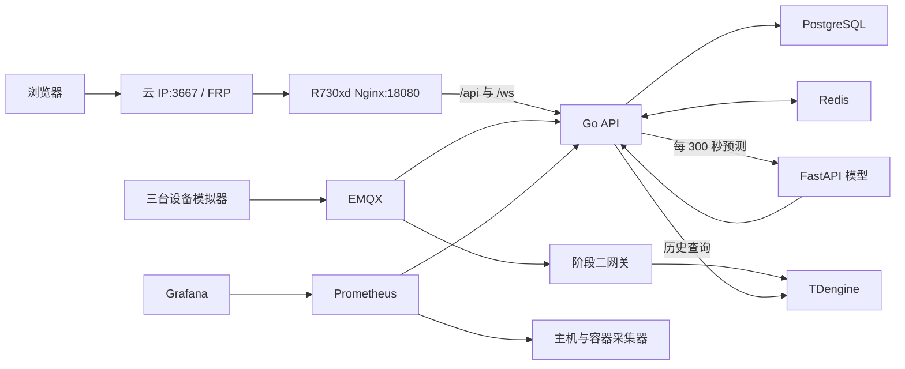

---
tags:
  - 源网智联
  - 运维
  - 二次开发
  - 开发阶段4
---

# 平台运维与二次开发手册 · 链路、源码与故障处理

> 本页面向接手服务器和源码的运维开发人员，解释网页功能背后的数据路径、关键文件、运行边界、排障方法和改动后的验证办法。对应阶段四第 13–15 周；具体服务器部署命令以 [[stages/04-frontend/deploy/README.md]] 为准。

## 一、系统边界与运行拓扑

生产演示环境运行在 R730xd 的 `/opt/powersystem`。`stages/04-frontend/deploy/compose.yaml` 统一编排 `emqx`、`tdengine`、`postgres`、`redis`、`ai-predict`、`gateway`、`api`、`simulator`、`frontend`、`node-exporter`、`cadvisor`、`prometheus` 和 `grafana`。阶段二网关是唯一运行的写入网关，阶段一网关只保留作原阶段源码，不要同时启动到同一演示数据链路。



Nginx 仅绑定 R730xd `127.0.0.1:18080`；现有 `frpc` 把它转发到云服务器 TCP `3667`。公网入口为 [演示网页](http://8.138.10.222:3667)。Prometheus 与 Grafana 只绑定内网服务器的回环地址 `19090`、`13000`，数据库、MQTT、AI 服务没有公网映射。Nginx 对公网 `/api/v1/auth/register` 返回 403，并对登录限速；注册演示账号用内网初始化脚本。当前入口是 HTTP，承载合成演示数据；域名、HTTPS 和完整 M3/M4 验收仍是后续事项。

## 二、源码从哪里读起

**前端与浏览器**

| 层 | 入口与关键文件 | 职责 |
| --- | --- | --- |
| Vue 页面 | `stages/04-frontend/src/router.ts`、`src/views/*.vue`、`src/layouts/ConsoleLayout.vue` | 路由守卫、登录/总览/设备/告警/预测页面与顶栏 |
| 浏览器数据层 | `src/lib/api.ts`、`auth.ts`、`realtime.ts`、`history.ts`、`format.ts`、`src/types.ts` | API 封装、会话、WebSocket、历史分段与抽稀、类型和格式 |
| 图表 | `src/components/TelemetryChart.vue` | ECharts 曲线展示 |

**服务端、预测与部署**

| 层 | 入口与关键文件 | 职责 |
| --- | --- | --- |
| Go HTTP | `stages/02-backend/internal/api/server.go`、`handlers.go`、`alarms.go`、`prediction.go`、`websocket.go`、`metrics.go` | 路由、设备与历史、告警、预测、实时和指标 |
| 采集与规则 | `internal/ingest/gateway.go`、`internal/service/alarm.go`、`internal/telemetry/telemetry.go` | MQTT 接入、可靠写入、越限判定 |
| 存储与配置 | `internal/store/store.go`、`internal/tdengine/client.go`、`internal/config/config.go`、`deploy/postgres/001_init.sql` | PostgreSQL/TDengine 操作、环境变量和表结构 |
| 预测服务 | `stages/03-ai-prediction/prediction/app.py`、`features.py`、`train.py` | 模型加载、30 分钟特征、训练 |
| 上线脚本 | `stages/04-frontend/deploy/` | Compose、Nginx、监控、FRP、备份与恢复 |

先读阶段源码 README，再读对应实现；根目录笔记记录设计和验收语义，运行代码以当前分支为准。对外接口统一返回 `code/message/data`；`src/lib/api.ts` 统一处理 Bearer JWT、非零业务码和 HTTP 401。登录会话存于浏览器当前标签页的 `sessionStorage`，不是跨设备的持久登录。

## 三、遥测从模拟器到曲线

1. `simulator` 以三台合成设备持续运行，每五秒经 MQTT `device/telemetry` 发布一次。未发出的数据保存在 `simulator-state` 卷里的 SQLite outbox，重启后可续发。
2. 阶段二 `gateway` 检查设备登记与场站关系，先把收到的数据落到 `gateway-state` 卷中的 SQLite WAL 队列，再确认 MQTT 消息。写入器按批向 TDengine 写历史序列，写成后删除队列项。排查丢点先看网关队列、再看 TDengine。
3. `api` 独立订阅同一主题，把 `(run_id, device_id, seq)` 唯一的消息保存到 PostgreSQL `telemetry_inbox`，之后确认 MQTT。处理器等待 TDengine 可读到样本，再在数据库事务内更新设备状态、处理告警并标记 inbox 已处理；随后刷新 Redis 最新值并广播 WebSocket。API 启动时会根据 inbox 重建最新值缓存。
4. 总览读 `/api/v1/dashboard/summary`、设备列表和最新告警；设备详情读 `/api/v1/devices/:id`、`.../telemetry/latest` 与 `.../telemetry`。历史接口每次最多查四小时，前端 `src/lib/history.ts` 将最长 24 小时的选择拆成多次请求、合并去重，并在浏览器内保留极值抽稀到适合图表的点数。

**存储分工**：TDengine 保存时序历史；PostgreSQL 保存用户、设备、规则、告警、预测和 inbox；Redis 保存临时最新值、WebSocket 凭证等。`gateway-state` 与 `simulator-state` 中的 SQLite 分别承载网关待写队列和模拟器待发队列；`api-state` 保存 API 的 MQTT 文件存储。数据库初始化 SQL 位于阶段二 `deploy/`。不要把 Redis 当成唯一的历史库，也不要因进程重启删除队列卷。

## 四、页面功能对应的接口与状态

**身份、总览与设备**

| 网页功能 | 前端实现 | 后端接口/计算 | 修改时注意 |
| --- | --- | --- | --- |
| 登录与退出 | `LoginView.vue`、`auth.ts`、`api.ts` | `POST /api/v1/auth/login`；JWT 守卫在 `server.go` | 401 会清会话并跳到登录页；公网注册被 Nginx 禁止 |
| 总览五卡 | `DashboardView.vue` | `GET /api/v1/dashboard/summary` | “运行正常占比”按状态统计；当前功率不是电量 |
| 近五分钟曲线 | `DashboardView.vue`、`TelemetryChart.vue` | 历史接口加 WebSocket 遥测 | 默认选择最近有上报的设备；断线时定时补查 |
| 设备筛选与详情 | `DevicesView.vue`、`DeviceDetailView.vue` | `/devices`、`/devices/:id`、`.../telemetry/latest`、`.../telemetry` | `group_name` 是完整分组名精确筛选；列表每页 20 条 |

**告警、预测与实时事件**

| 网页功能 | 前端实现 | 后端接口/计算 | 修改时注意 |
| --- | --- | --- | --- |
| 告警筛选/确认 | `AlarmsView.vue` | `/alarms`、`/alarms/:id`、`POST /alarms/:id/ack` | 确认仅记录人和时间；状态恢复取决于实测值 |
| 故障预测 | `PredictionsView.vue` | `/predictions`、`/devices/:id/prediction` | 超过 15 分钟标过期；无足够新鲜数据可无结果 |
| 实时状态与提示音 | `ConsoleLayout.vue`、`realtime.ts` | `/ws-ticket`、`/ws/realtime` | 票据短时有效且一次性；断线重取票据 |

`server.go` 还暴露设备增删改、告警规则增删改接口，便于运维与二次开发；目前网页没有对应的编辑表单。增加表单前应先确认 API 的字段校验、权限和演示数据影响，不能以页面隐藏代替后端授权。

### 告警闭环

`internal/service/alarm.go` 对每台设备和指标维护活动告警。规则匹配时产生“未处理”记录；人工确认写操作人及时间；指标恢复后更新为“已恢复”。同一活动异常不应因为每次上报都生成新告警。规则接口位于 `internal/api/alarms.go`，默认演示规则的来源见阶段二部署配置及初始化流程。修改阈值或状态机时，同时检查 Go 单测、前端文案和历史数据兼容性。

### 实时连接

浏览器先用 Bearer JWT 调 `POST /api/v1/ws-ticket`；Go API 在 Redis 存储约一分钟有效的一次性票据。浏览器再连同源 `/ws/realtime?ticket=...`，服务端消费票据并校验 Origin。`src/lib/realtime.ts` 断线时指数退避，最长约 30 秒，**每次重连重新申请票据**；总览和告警页面有轮询兜底。生产同源访问依赖 Nginx `/ws/` 的 Upgrade 头；本地跨端口开发要按配置写精确 `WS_ALLOWED_ORIGINS`。

## 五、预测链路与模型边界

Go API 的 `predictionWorker` 启动后约 15 秒首次执行，之后按 `AI_POLL_SECONDS=300` 秒轮询。它只处理最近约两分钟内有数据、没有明确故障状态的设备，从 TDengine 提取近三十分钟遥测。Python `features.py` 形成 30 个一分钟桶和 15 个特征，要求至少 27 分钟有样本且连续缺口不过大；不满足条件时跳过预测，前端可显示“暂无预测”。

FastAPI `POST /predict` 使用模型目录里的 `model.json`、`metadata.json`，返回故障概率、阈值、版本、来源和主要特征贡献。Go API 对调用设置约五秒超时，将结果持久化到 PostgreSQL `prediction_records`，以 `(device_id, window_end_ms, model_version)` 避免重复；高风险可触发 AI 告警，风险降低后可恢复。模型当前来源为 `synthetic-trained`，特征贡献是模型解释，不是根因分析。换模型时需核对 `features.py` 的字段顺序、模型元数据与 API 响应契约，再做离线评估和现场数据验收；不要仅替换 `model.json` 就视为上线完成。

## 六、部署、配置与发布

在 R730xd 项目根目录按 `deploy/README.md` 运行 `init-server.sh`、Compose 配置校验及 `up -d --build`。`init-server.sh` 生成私有 `.env`，模型运行资产来自被忽略的 `artifacts/stage3/model/`，在服务器放到 `runtime/model/` 并以只读方式挂给 AI 容器。`POSTGRES_PASSWORD`、`REDIS_PASSWORD`、`TDENGINE_ROOT_PASSWORD`、`JWT_SECRET`、`GRAFANA_ADMIN_PASSWORD` 等只存于服务器私有配置；本笔记不记录真实值。`internal/config/config.go` 是后端环境变量和默认值的权威入口。

常用检查命令（在服务器 `/opt/powersystem` 执行）：

```bash
docker compose --env-file .env -f stages/04-frontend/deploy/compose.yaml config --quiet
docker compose --env-file .env -f stages/04-frontend/deploy/compose.yaml ps
docker compose --env-file .env -f stages/04-frontend/deploy/compose.yaml logs --since=10m api gateway simulator ai-predict frontend
curl -fsS http://127.0.0.1:18080/api/v1/ping
```

修改前记下 Git 提交号、镜像状态并运行一次加密备份；修改后先在本机验证，再构建受影响的服务，检查健康状态和公网关键路径。不要对在线环境执行 `docker compose down -v`，它会删除持久卷。回退代码/镜像时保留数据卷，若涉及数据库结构变更，还需单独设计向前兼容与回退方案。完整的 FRP 追加代理、初始化账号和备份命令见部署 README 与第十五周笔记。

## 七、监控、备份与恢复

`internal/api/metrics.go` 提供仅内网采集的 `/metrics`。`prometheus.yml` 每 15 秒抓 API、`node-exporter` 主机指标和 `cadvisor` 容器指标；`alerts.yml` 包含 API 连续不可用和磁盘使用率超过 80% 的规则。`grafana-dashboard.json` 通过 provider 自动装载看板，可用 SSH 本地端口转发访问 R730xd 的 `127.0.0.1:13000`。Grafana 目前仅有页面可见告警，未配置邮件或 Webhook 通知。

R730xd 的定时任务每天调用 `backup.sh`：PostgreSQL `pg_dump`、TDengine `taosdump`、网关和模拟器 SQLite 在线快照、模型资产、校验和打包后用 GPG AES256 加密，经专用 SFTP 账号传到云端；保留约七天。加密口令在服务器私有文件 `/etc/powersystem/backup-passphrase`。`restore-verify.sh` 创建独立 Compose 项目和数据卷，解密校验并恢复 PostgreSQL/TDengine、核对队列文件，不触碰在线生产卷。既往演练证据见 [[开发阶段4-前端、上线与沉淀/05-运维与恢复]]；每次改备份格式或数据库版本都应重做隔离恢复演练。

Grafana 的访问方式是从运维工作站建立 SSH 本地转发 `ssh -L 13000:127.0.0.1:13000 root@192.168.111.2`，随后在该工作站打开 `http://127.0.0.1:13000`。此入口只在该 SSH 连接存续时有效；Grafana 登录密码从服务器私有配置获取，不写到仓库。

**入口与数据链路**

| 现象 | 检查顺序 | 典型位置 |
| --- | --- | --- |
| 公网打不开，内网入口正常 | 云端 `3667` 监听、现有 `frps`、R730xd `frpc` 代理及本地 `18080` | `add-frp-proxy.sh`、`nginx.conf`、FRP 服务日志 |
| 页面 502 或登录失败 | `frontend`、`api` 健康检查，Nginx 代理和 API 日志 | `compose.yaml`、`server.go` |
| 实时断开、刷新可看旧值 | `/ws-ticket`、Redis、Nginx Upgrade、Origin、浏览器重连 | `websocket.go`、`realtime.ts` |
| 模拟器有日志但曲线停住 | MQTT、网关 SQLite 积压、TDengine、API inbox 处理与时间范围 | `gateway.go`、`client.go`、`server.go` |

**业务结果与运维**

| 现象 | 检查顺序 | 典型位置 |
| --- | --- | --- |
| 告警未按预期出现 | 设备与规则、实测值、inbox 处理事务和状态机 | `alarms.go`、`service/alarm.go` |
| 预测空白/过期 | AI 健康、模型文件、最新遥测时间、30 分钟窗口、轮询日志 | `prediction.go`、`features.py`、`app.py` |
| 看板无数据 | Prometheus targets、API `/metrics`、采集器容器、Grafana 数据源 | `prometheus.yml`、`grafana-datasource.yml` |
| 备份失败 | cron 日志、磁盘空间、数据库导出、GPG、SFTP 和云端保留策略 | `backup.sh`、`restore-verify.sh` |

排障前先记故障时间和请求路径，按“入口 → 服务 → 消息 → 存储”缩小范围；日志中出现密码、JWT 或个人信息时不要直接贴到公开笔记。

## 八、二次开发的最小改动路径

1. **改现有页面文案或展示**：找对应 `src/views/*.vue`；共有顶栏在 `ConsoleLayout.vue`，曲线在 `TelemetryChart.vue`，格式在 `format.ts`。若只是展示改动，不改接口或数据库。
2. **加一个只读字段**：先确认数据源与 PostgreSQL/TDengine 字段，再在 Go `model`、查询及 `handlers.go`/对应 API 增加字段；同步更新 `src/types.ts`、`src/lib/api.ts` 与页面。接口成功包络仍保持 `code/message/data`。
3. **加一个页面或写操作**：在 `router.ts` 增路由，创建 `src/views/` 页面；后端在 `server.go` 注册受 JWT 保护的路由，服务端校验输入与权限。需要新表时写迁移脚本，兼顾已部署数据库；不要仅改初始化 SQL。
4. **改告警规则**：阅读 `alarms.go` 与 `service/alarm.go` 的规则匹配、去重、确认与恢复；增加指标时同步更新遥测解析、规则验证、前端标签与测试。用合成数据验证“触发一次、确认一次、恢复一次”。
5. **改预测模型**：从 `features.py` 的窗口、缺失值和特征顺序开始；同步训练、`app.py` 响应、Go `prediction.go`、前端 `PredictionsView.vue`。保留模型版本并比较旧版结果，验证“无数据/过期/高风险”三个分支。
6. **改部署和可观测性**：改 `compose.yaml`、`nginx.conf`、`prometheus.yml`/`alerts.yml`、Grafana JSON 后做配置校验；若引入新持久数据，更新 `backup.sh` 和隔离恢复脚本，再验证备份确实含新数据。

改动的基础验证：

```bash
# 在 stages/04-frontend
npm run typecheck
npm test
npm run build
# 在 stages/02-backend
go test ./...
# 在 stages/03-ai-prediction
python -m unittest discover -s tests -v
```

这些命令验证代码本身；上线后还要核对登录、设备最新值与历史曲线、告警详情/确认、预测状态、WebSocket 重连及 Grafana。当前第十五周部署不自动等于 M3/M4 通过，不据此合并 `main` 或打发布标签。

## 相关笔记

- 使用说明与产物：[[平台使用手册]] · [[运行产物说明]]
- 阶段四索引与部署：[[开发阶段4-前端、上线与沉淀/00-索引·开发阶段4-前端、上线与沉淀]] · [[stages/04-frontend/README.md]] · [[stages/04-frontend/deploy/README.md]]
- 运行证据：[[开发阶段4-前端、上线与沉淀/04-第15周·部署上线]] · [[开发阶段4-前端、上线与沉淀/05-运维与恢复]]
- 工程规范：[[项目工程规范]]
