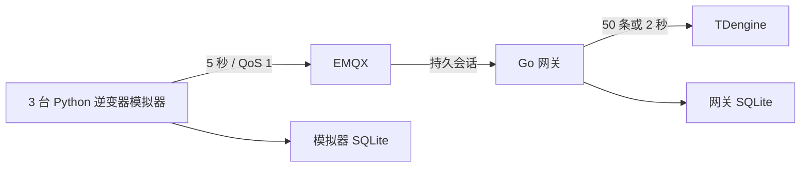

---
tags:
  - 开发实战
  - 阶段一
  - 索引
  - 源网智联
---

# 开发实战 · 索引

> 阶段一目标：3 台逆变器模拟器 → EMQX → Go 网关 → TDengine。依据《新能源设备智能运维平台项目实战路线图》的第 1–4 周，实施细节以本目录和根目录 `README.md` 为准。

1. [[01-环境与Git]]：本地环境、容器、Git 分支与验收门槛。
2. [[02-逆变器模拟器]]：参数来源、日照/温度/故障前兆模型、SQLite 待发队列。
3. [[03-Go网关与时序入库]]：校验、手动确认、持久化、批写、去重。
4. [[04-阶段一测试与交付]]：一小时测试、日志、故障注入、审查与移交。
5. [[05-项目文件位置与迁移清单]]：每个新增文件的绝对位置、生成物和 Docker 卷。

现有设计背景见 [[架构设计/00-索引·架构设计]]、[[需求分析/00-索引·需求分析]]、[[技术选型/00-索引·技术选型]]。阶段一不包含前端、告警、Redis 或 PostgreSQL 的部署。
