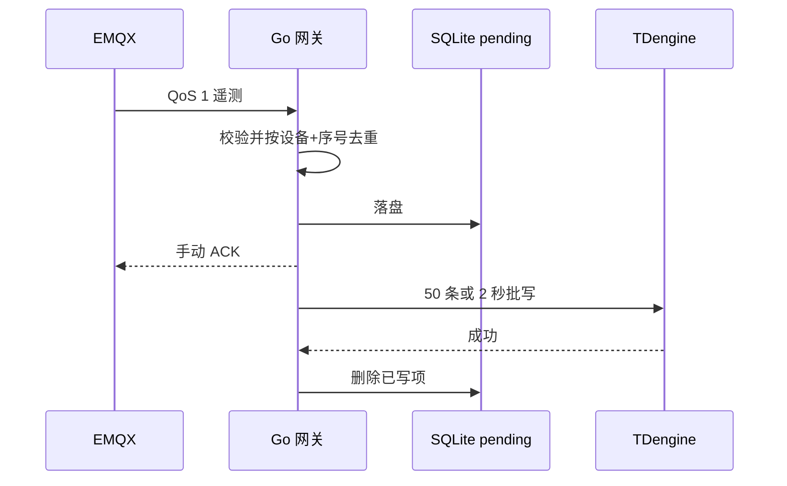

---
tags:
  - 开发实战
  - 阶段一
  - Go
  - MQTT
  - TDengine
---

# 03 · Go 网关与时序入库

> 回到 [[00-索引·开发实战]]；对应路线图第 3 周；设计背景见 [[架构设计/03-数据库设计]]。

网关以固定客户端 ID、`Clean Session=false` 订阅 `device/telemetry` 的 QoS 1 消息。手动确认顺序是：解析与物理范围校验 → SQLite `pending` 持久落盘 → MQTT ACK；不合格消息记结构化日志并确认丢弃。有效数据按 `(device_id, seq)` 去重。SQLite 使用 WAL、同步 FULL，MQTT 客户端状态使用文件存储。失败写库时 `pending` 保留，重连和每 2 秒定时重试。

写库一次至多 50 条；达到 50 条立即刷，未满 50 条在 2 秒定时刷。TDengine REST 返回成功后，网关再删除队列项。重复送达的同设备同序号不会新增 SQLite 记录；TDengine 子表以时间戳为键。网关检查设备编号、时间范围、400 V 三相电气关系、160.4 A 上限和字段值，拒绝畸形 JSON。

`deploy/tdengine/init.sql` 是唯一由脚本执行的 TDengine 3 建库模板：毫秒精度、365 天保留期、超级表 `telemetry`，按设备创建 3 张子表。`seq` 是可对账序号；`device_id` 与 `station_id` 是 tag。每个运行编号对应独立数据库。可使用 REST 执行 `SELECT COUNT(*) FROM <运行编号>.telemetry`，或看运行目录的 `telemetry.csv` 与 `reconciliation.json`。

**边界**：MQTT PUBACK 只证明 Broker 接收，不证明网关已入库；完整性要以 `generated` 与 TDengine 逐条对账为准。Broker 离线期间的原始数据由模拟器 SQLite 保留，网关离线期间的 MQTT 消息依赖 EMQX 持久会话；网关已确认但写库失败的消息由网关 SQLite 保留。
