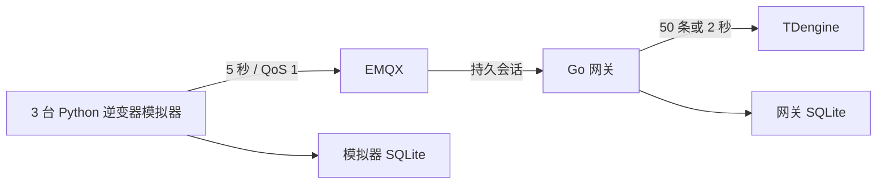

---
tags:
  - 开发阶段1
  - 阶段一
  - 索引
  - 源网智联
---

# 开发阶段1 · 数据链路索引

> 阶段一笔记索引；运行命令见 `stages/01-data-chain/README.md`。
>
> 本文件夹是「源网智联」的**阶段一数据链路**笔记。阶段一只做一件事：**让 3 台逆变器模拟器产生的遥测数据，经 EMQX 和 Go 网关，最终一条不差地落到 TDengine 时序库。** 依据《新能源设备智能运维平台项目实战路线图》第 1–4 周，实施细节以本目录及 `stages/01-data-chain/README.md` 为准。

## 一、阶段一在做什么

一句话：**打通数据链路的地基**。不写界面、不做登录、不碰告警，先证明「数据能从设备流到数据库，并在本阶段故障注入测试中无缺失」。

> 本阶段通过完整一小时故障注入测试验证数据完整性；实测结果见 [[开发阶段1-数据链路/04-阶段一测试与交付]]。

## 二、笔记导航

| 笔记 | 内容 | 对应路线图 |
| --- | --- | --- |
| [[开发阶段1-数据链路/01-环境与Git]] | 本地环境、容器、Git 分支与验收门槛 | 第 1 周 |
| [[开发阶段1-数据链路/02-逆变器模拟器]] | 参数来源、日照/温度/故障前兆模型、SQLite 待发队列 | 第 2 周 |
| [[开发阶段1-数据链路/03-Go网关与时序入库]] | 校验、手动确认、持久化、批写、去重 | 第 3 周 |
| [[开发阶段1-数据链路/04-阶段一测试与交付]] | 一小时测试、日志、故障注入、审查与移交 | 第 4 周 |
| [[开发阶段1-数据链路/05-阶段一目录迁移记录]] | 阶段一目录整理、M1 证据位置与当时未入库的卷 | 历史快照 |

## 三、本阶段边界

阶段一的验收范围**不包含**前端、告警、Redis 或 PostgreSQL 的部署；这些能力由后续阶段实现，不能用后续代码的结果改写 M1 结论。

## 相关笔记

- 设计背景：[[架构设计/00-索引·架构设计]] · [[需求分析/00-索引·需求分析]] · [[技术选型/00-索引·技术选型]]
- 下一章：[[开发阶段1-数据链路/01-环境与Git]]
