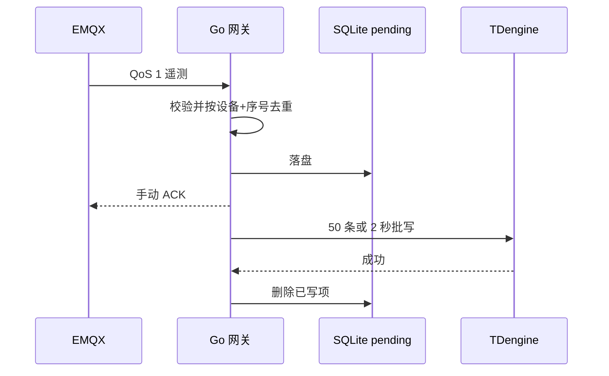

---
tags:
  - 开发阶段1
  - 阶段一
  - Go
  - MQTT
  - TDengine
---

# 03 · Go 网关与时序入库

> 回到 [[开发阶段1-数据链路/00-索引·开发阶段1-数据链路]]；对应路线图第 3 周；设计背景见 [[架构设计/03-数据库设计]]。

本页说明：**网关如何订阅、校验、落盘、写库，以及如何在阶段一故障测试中验证完整性。**

## 一、订阅与确认

网关以固定客户端 ID、`Clean Session=false` 订阅 `device/telemetry` 的 QoS 1 消息。

| 环节 | 做法 |
| --- | --- |
| 解析与校验 | 物理范围校验 |
| 持久落盘 | 写入 SQLite `pending` |
| 确认 | 校验通过后 MQTT ACK |
| 不合格消息 | 记结构化日志并确认丢弃 |

> 手动确认顺序是「校验 → 落盘 → ACK」，先落盘再确认，避免确认后写库失败丢数据。

## 二、去重与可靠性

| 项 | 约定 |
| --- | --- |
| 去重键 | `(device_id, seq)` |
| SQLite 模式 | WAL、同步 FULL |
| MQTT 客户端状态 | 文件存储 |
| 写库失败 | `pending` 保留，重连和每 2 秒定时重试 |

## 三、批量写库

| 规则 | 说明 |
| --- | --- |
| 单批上限 | 50 条 |
| 触发刷写 | 满 50 条立即刷；未满 50 条在 2 秒定时刷 |
| 删除时机 | TDengine REST 返回成功后，网关才删除队列项 |
| 去重效果 | 重复送达的同设备同序号不新增 SQLite 记录 |
| TDengine 主键 | 子表以时间戳为键 |

## 四、校验内容

网关检查：设备编号、时间范围、400 V 三相电气关系、160.4 A 上限和字段值，拒绝畸形 JSON。

## 五、建库与对账

`stages/01-data-chain/deploy/tdengine/init.sql` 是唯一由脚本执行的 TDengine 3 建库模板：

| 项 | 设定 |
| --- | --- |
| 精度 | 毫秒 |
| 保留期 | 365 天 |
| 超级表 | `telemetry` |
| 子表 | 按设备创建 3 张 |
| 序号 | `seq` 为可对账序号 |
| tag | `device_id` 与 `station_id` |

每个运行编号对应独立数据库。可用 REST 执行 `SELECT COUNT(*) FROM <运行编号>.telemetry`，或查看运行目录的 `telemetry.csv` 与 `reconciliation.json`。

## 六、边界（重要）

- MQTT PUBACK 只证明 **Broker 接收**，不证明网关已入库；
- 完整性要以 `generated` 与 TDengine **逐条对账**为准；
- Broker 离线期间原始数据由**模拟器 SQLite** 保留；
- 网关离线期间 MQTT 消息依赖 **EMQX 持久会话**；
- 网关已确认但写库失败的消息由**网关 SQLite** 保留。

## 相关笔记

- 上一章：[[开发阶段1-数据链路/02-逆变器模拟器]]
- 下一章：[[开发阶段1-数据链路/04-阶段一测试与交付]]
