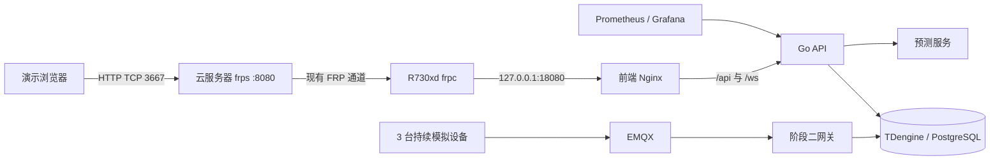

---
tags:
  - 源网智联
  - 开发阶段4
  - 第15周
  - 部署
---

# 04 · 第15周·部署上线

> 对应路线图第 15 周部署任务。记录 2026-09-28 R730xd 内网运行、FRP 公网演示和实测范围。当时的部署不构成 M3/M4 验收；M3 后来独立通过，M4 仍待验收。

## 一、拓扑与部署位置

- R730xd 的项目目录为 `/opt/powersystem`，统一编排在 `stages/04-frontend/deploy/compose.yaml`。数据库和模型均使用服务器独立卷与合成演示数据；没有迁移 Windows 本机数据库。
- 上线只运行阶段二网关。三台设备按 **5 秒**间隔持续上报，模拟器、网关队列持久化；API 预测轮询为正式的 **300 秒**。
- Nginx 仅绑定 R730xd 的 `127.0.0.1:18080`。云端沿用 `frps`，R730xd 现有 `frpc` 只追加 `powersystem-stage4-web`，将本地 18080 转到云端 **3667**。原有 2024、3000、2222、7070 代理连通性复核通过。
- 公网入口为 `http://8.138.10.222:3667`；Nginx 拒绝公网注册接口。演示账号 `demo-operator` 从内网初始化，口令保存在服务器 `/etc/powersystem/demo-password`，不写入仓库或笔记。

> 本周依用户选择使用 IP + HTTP。公网只存合成演示数据；域名、HTTPS、密钥登录及关闭 root 密码登录留待后续安全收尾。两台服务器现有 root/密码 SSH 配置本周未改。

## 二、部署验证

**本机预检**

- 前端 `npm run typecheck`、`npm test`（5 文件、6 用例）和 `npm run build` 通过。
- 阶段二 `go test ./...`、阶段三 Python 4 个现有测试通过；部署 Bash 脚本语法检查和服务器 Compose 配置校验通过。

**公网端到端**

- `GET /api/v1/ping` 正常，前端返回 200；`POST /api/v1/auth/register` 返回 **403**。
- 公网账号登录成功；设备总数 **3**、在线 **3**；WebSocket 成功收到 `telemetry` 事件，关闭连接后重新换取 ticket 再次建连并收到遥测。
- 查询总览、设备、告警与预测接口成功；三台设备均产生预测记录。用实时遥测触发一条受控告警，公网账号将告警 **#1** 确认，记录 `acked_by=1`，随后删除临时规则。
- 数据入库持续增长。首次备份时 PostgreSQL 遥测 inbox 与 TDengine 均为 **597** 条；预测记录在完整窗口形成后为 **3** 条。
- 重启模拟器容器后，其 SQLite 队列仍在原数据卷，inbox 从 **2226** 增至 **2235**，证实持续上报与持久卷可用。公网浏览器登录后待连接建立，工作台显示“实时连接正常”。

运行证据保存在被 Git 忽略的 `artifacts/stage4/`，包括公网登录页与 Grafana 看板截图。运维恢复记录见 [[05-运维与恢复]]。

## 三、里程碑边界

> 这次部署证明本周服务器与公网演示路径可用，在 2026-09-28 当时不构成 M3 或 M4 验收。2026-09-29 的完整 M3 自动验收此后独立通过并发布，真实场站泛化边界见 [[开发阶段3-AI预测模块/06-阶段三收尾与验收结论]]；本周阶段四部署仍不构成 M4 验收。第 16 周视频与交付材料仍待完成。

## 相关笔记

- 索引：[[00-索引·开发阶段4-前端、上线与沉淀]]
- 运维：[[05-运维与恢复]]
- 演示：[[03-逐步演示脚本]]
- 上游：[[开发阶段3-AI预测模块/06-阶段三收尾与验收结论]]
- 后续：[[06-P0收尾与M4验收记录]]
