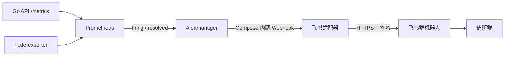

---
tags:
  - 源网智联
  - 开发阶段5
  - 飞书通知
  - 架构
---

# 01 · 飞书告警链路与实现

> 本页说明原路线图第 15 周监控能力的阶段五扩展及实现位置。它通知的是 Prometheus 基础设施告警；设备越限告警仍由阶段二 Go API 管理。运行命令见 [[stages/05-feishu-notification/README.md]]。

## 一、从规则到群消息

Prometheus 每 15 秒采集目标和评估规则。`PowerSystemAPIDown` 在 API 抓取失败超过 1 分钟后触发；`PowerSystemDiskHigh` 在主机文件系统使用率超过 80% 持续 5 分钟后触发。规则文件仍归阶段四服务器部署 `stages/04-frontend/deploy/alerts.yml`；阶段五 `deploy/alertmanager.yml` 控制分组、等待、重复间隔和 `send_resolved: true`。Compose 仍是阶段四统一部署入口，但适配器构建上下文指向 `stages/05-feishu-notification/feishu-adapter/`。

适配器将同一批事件中的 `firing` 和 `resolved` 分别写成“触发”和“恢复”，包含规则名、级别、时间和摘要。单次消息最多列 20 条，超出则提示剩余数量。发送失败返回 502，让 Alertmanager 按自身重试机制处理；成功返回 200。两条消息的实际群内可见性需由群成员确认。

## 二、密钥和访问边界

- 机器人地址和签名密钥分别来自服务器 `/etc/powersystem/feishu-webhook-url`、`/etc/powersystem/feishu-sign-secret`；文件权限为 600，不存于 Compose 环境变量或仓库。
- 容器启动时读取两份私有文件，检查 Webhook 是飞书官方 HTTPS 机器人路径，随后降为 UID/GID 65532 运行 HTTP 服务。
- Alertmanager 通过 Compose 内网访问适配器 `8091`；该端口没有对主机或公网映射。适配器只接受 `/alertmanager` 的 POST，`/health` 用于容器健康检查。
- 签名使用飞书群机器人所需的时间戳与 HMAC-SHA256。测试只使用占位密钥和模拟响应；日志摘要不输出 URL、密钥或原始事件载荷。

> 当前公网演示入口为 IP + HTTP，且仅展示合成设备数据；群通知经适配器主动访问飞书 HTTPS。两者的传输边界不同。域名、网页 HTTPS/WSS 按项目所有者决定延期。

## 三、功能边界与扩展点

| 需求 | 当前实现 | 如需扩展 |
| --- | --- | --- |
| API 故障通知 | 已实测触发和恢复 | 调整 `alerts.yml` 的阈值后重做现场演练 |
| 磁盘高占用通知 | 规则已配置，未做真实越限送达 | 在隔离测试环境注入并保存群内证据 |
| 设备越限、AI 风险 | 网页、数据库和 WebSocket 已有业务闭环；飞书未接入 | 先明确接收人、去重、频控和恢复语义，再设计独立规则或业务事件桥接 |
| 多群或值班路由 | 尚无 | 按场站/级别分组前审查机器人权限与隐私范围 |

## 相关笔记

- 本阶段：[[00-索引·开发阶段5-飞书告警通知]] · [[02-验证与运维]]
- 上游监控：[[开发阶段4-前端、上线与沉淀/05-运维与恢复]]
- 运维入口：[[平台运维与二次开发手册]] · [[stages/05-feishu-notification/README.md]]
