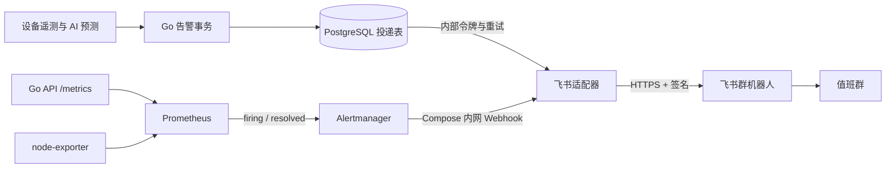

---
tags:
  - 源网智联
  - 开发阶段5
  - 飞书通知
  - 架构
---

# 01 · 飞书告警链路与实现

> 第一版阶段五承接两类事件：设备越限/AI 风险的业务状态变化，以及 Prometheus 基础设施告警。业务事件由 Go API 管理并经持久投递表送至同一飞书适配器。运行命令见 [[stages/05-feishu-notification/README.md]]。

## 一、从规则到群消息

Prometheus 每 15 秒采集目标和评估规则。`PowerSystemAPIDown` 在 API 抓取失败超过 1 分钟后触发；`PowerSystemDiskHigh` 在主机文件系统使用率超过 80% 持续 5 分钟后触发。规则文件仍归阶段四服务器部署 `stages/04-frontend/deploy/alerts.yml`；阶段五 `deploy/alertmanager.yml` 控制分组、等待、重复间隔和 `send_resolved: true`。Compose 仍是阶段四统一部署入口，但适配器构建上下文指向 `stages/05-feishu-notification/feishu-adapter/`。

适配器将同一批事件中的 `firing` 和 `resolved` 分别写成“触发”和“恢复”，包含规则名、级别、时间和摘要。单次消息最多列 20 条，超出则提示剩余数量。发送失败返回 502，让 Alertmanager 按自身重试机制处理；成功返回 200。两条消息的实际群内可见性需由群成员确认。

业务告警的创建、确认、自然恢复、规则或设备配置关闭与 `business_notification_outbox` 同事务提交；AI 高风险使用 `ai_failure_risk` 指标，按预测高低状态变化生成业务告警。`event_key=alarm:<ID>:<状态>` 约束重复写入；Go API 后台每 2 秒取待发送任务，通过独立令牌 POST 到 `/business`。适配器校验令牌和字段，生成含事件 ID 的飞书文本。失败按 2～128 秒退避，成功才标记 `sent_at`。这是至少一次投递：若飞书已接收而确认响应丢失，重试可能产生同一事件 ID 的重复群消息。

## 二、密钥和访问边界

- 机器人地址和签名密钥分别来自服务器 `/etc/powersystem/feishu-webhook-url`、`/etc/powersystem/feishu-sign-secret`；文件权限为 600，不存于 Compose 环境变量或仓库。
- 内部业务令牌由 `init-server.sh` 在 `/etc/powersystem/business-notify-token` 生成，通过 Compose 私有挂载同时提供给 API 与适配器；令牌只用于 `/business`，不复用机器人签名密钥。
- 容器启动时读取两份私有文件，检查 Webhook 是飞书官方 HTTPS 机器人路径，随后降为 UID/GID 65532 运行 HTTP 服务。
- Alertmanager 通过 Compose 内网访问适配器 `8091`；该端口没有对主机或公网映射。适配器只接受 `/alertmanager` 的 POST，`/health` 用于容器健康检查。
- 签名使用飞书群机器人所需的时间戳与 HMAC-SHA256。测试只使用占位密钥和模拟响应；日志摘要不输出 URL、密钥或原始事件载荷。

> 历史公网演示入口为 IP + HTTP，仅展示合成设备数据；这不是第一版安全验收状态。域名不作为本轮条件，公网入口仍须加密或关闭，并另行记录现场结果。群通知经适配器主动访问飞书 HTTPS。

## 三、功能边界与扩展点

| 需求 | 当前实现 | 如需扩展 |
| --- | --- | --- |
| API 故障通知 | 已实测触发和恢复 | 调整 `alerts.yml` 的阈值后重做现场演练 |
| 磁盘高占用通知 | 规则已配置，未做真实越限送达 | 在隔离测试环境注入并保存群内证据 |
| 设备越限、AI 风险 | 业务触发、确认、恢复及配置关闭已写入持久投递；适配器文案本地测试通过 | 服务器群内送达、重试和去重须新验收 |
| 多群或值班路由 | 尚无 | 按场站/级别分组前审查机器人权限与隐私范围 |

## 相关笔记

- 本阶段：[[00-索引·开发阶段5-飞书告警通知]] · [[02-验证与运维]]
- 上游监控：[[开发阶段4-前端、上线与沉淀/05-运维与恢复]]
- 运维入口：[[平台运维与二次开发手册]] · [[stages/05-feishu-notification/README.md]]
