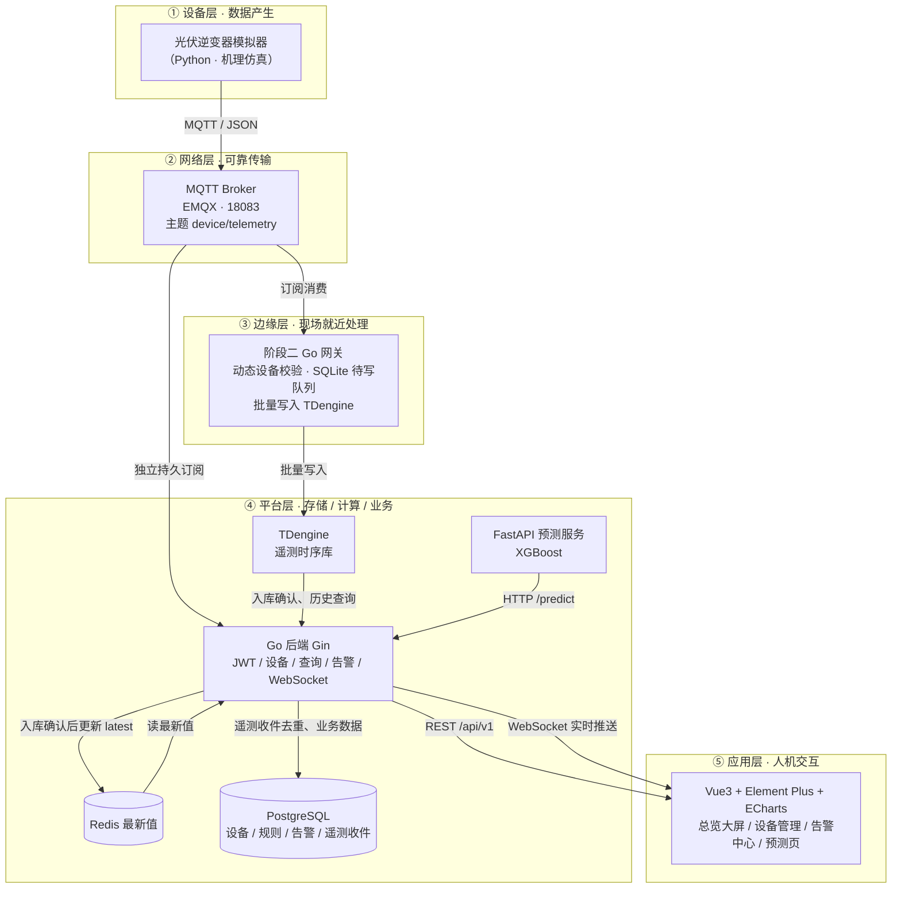

---
tags:
  - 架构设计
  - 系统架构
  - Mermaid
  - 源网智联
---

# 01 · 系统架构图

> 回到 [[00-索引·架构设计]]
> 对应手册任务 9（画系统架构图）

架构图回答「系统长什么样」。技术选型选出零件，这里把它们按**五层骨架**组装起来，并用连线标出协议与数据格式。

## 一、五层骨架（手册 4.1 通用结构）

工业物联网系统通用的五层结构，本项目直接套用。分层的好处是「各层只对自己的接口负责」：换传感器不动平台层、前端换框架不动后端。

| 层 | 职责 | 本项目对应 |
| --- | --- | --- |
| **设备层** | 产生和采集数据 | 光伏逆变器、温度/电流传感器（前期用**机理仿真模拟器**代替） |
| **边缘层** | 协议转换、数据缓存、断网续传 | Go 边缘网关程序 |
| **网络层** | 可靠传输 | MQTT over TCP，断线重连与 QoS 机制 |
| **平台层** | 存储、计算、业务逻辑 | Go 后端 Gin + PostgreSQL + TDengine + Redis + FastAPI 预测服务 |
| **应用层** | 人机交互 | Vue3 Web 运维平台、实时大屏、告警中心 |

## 二、系统架构图（Mermaid）

> 本图 PNG 存档见 `diagrams/architecture.png`。

## 三、组件清单（每个组件来自哪个选型）

| 组件 | 所属层 | 选型来源 | 关键能力 |
| --- | --- | --- | --- |
| 光伏逆变器模拟器 | 设备层 | [[技术选型/02-物联网接入]] | 机理仿真、异常注入、每 5 秒上报 |
| EMQX | 网络层 | [[技术选型/02-物联网接入]] | 中心 Broker、Docker 一键、Dashboard |
| Go 边缘网关 | 边缘层 | [[技术选型/01-后端技术栈]] | goroutine+channel 解耦、断网续传 |
| TDengine | 平台层 | [[技术选型/03-数据存储]] | 遥测写入吞吐/压缩率、国产化 |
| PostgreSQL | 平台层 | [[技术选型/03-数据存储]] | 业务数据、GORM 对接 |
| Redis | 平台层 | [[技术选型/03-数据存储]] | 设备最新值、健康排行 |
| Go 后端 Gin | 平台层 | [[技术选型/01-后端技术栈]] | 认证/设备/告警/查询、WebSocket |
| FastAPI 预测服务 | 平台层 | [[技术选型/05-AI预测模型]] | XGBoost 故障预测、/predict |
| Vue3 前端 | 应用层 | [[技术选型/04-前端与实时推送]] | 六大页面、ECharts 曲线 |

## 四、三条关键设计决策

1. **云边协同**：网关在边缘就近做「解析校验 + 批量写库 + 断网缓存」，弱网/断网时数据落本地（SQLite/文件队列），恢复后补传——这是 [[需求分析/04-非功能需求清单]] NFR-04/NFR-05 的架构来源，也是「数据完整率 ≥99.9%」的底气。
2. **AI 服务化解耦**：预测模型不塞进 Go 后端，单独起 FastAPI 服务，Go 通过 HTTP 调 `/predict`。理由：训练（Python 生态）与上线（Go 服务）互不拖累，模型迭代不重启后端。
3. **读写分离**：遥测（写多读少）走 TDengine、业务（写少读多）走 PostgreSQL、最新值（高频读）走 Redis——三类数据各归其位，避免单一数据库被遥测海量写入拖垮。

> 阶段二实际数据路径见上图：EMQX 将同一消息送给持久网关和 Gin 服务；Gin 的 PostgreSQL 收件表等候 TDengine 入库确认，再更新 Redis 与告警。图中的 FastAPI、Vue3 属于后续阶段目标，阶段二仅有 `/test/ws` 测试页。

## 五、验收自检（任务 9 标准）

- [x] 图上有明确的五层；
- [x] 每条连线标注了协议（MQTT/JSON、HTTP/REST、WebSocket）；
- [x] 能指着图讲出阶段二路径：模拟器 → EMQX → 网关和后端双订阅 → TDengine 入库确认 → Redis/告警 → WebSocket；正式 Vue3 前端属于后续阶段。

## 六、第一版阶段五通知架构

上方五层图及存档 PNG 是原四阶段设计基线。第一版阶段五有两条进入同一签名适配器的路径：设备越限/AI 风险状态变化与 PostgreSQL 业务记录同事务写入 `business_notification_outbox`，Go API 后台按事件键投递并失败重试；Prometheus 的 API 与磁盘规则经 Alertmanager 发送监控事件。适配器通过 HTTPS 将两类消息送往飞书值班群。浏览器 WebSocket 仍是另一条实时路径。原图未画后加组件，当前完整通知关系见 [[开发阶段5-飞书告警通知/01-链路与实现]]。

> 下一章：[[02-数据流设计]] — 架构图是静态结构，数据流是动态过程：一条温度数据怎么在组件间「漂流」。

## 相关笔记

- 本模块索引：[[00-索引·架构设计]]
- 后续扩展：[[开发阶段5-飞书告警通知/00-索引·开发阶段5-飞书告警通知]]
