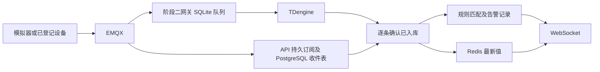

---
tags:
  - 源网智联
  - 开发阶段2
  - 告警
  - WebSocket
---

# 03 · 告警闭环与实时推送

> 回到 [[第一版-平台主体/开发阶段2-后端主体/00-索引·开发阶段2-后端主体]]；对应路线图第 7 周，落实 FR-02、FR-03、FR-04。

## 一、入库后处理

网关和 API 分别在本地队列或 PostgreSQL 收件表落盘后才确认 MQTT QoS 1 消息。收件表唯一键为 `(run_id, device_id, seq)`，重投不会产生第二次告警；后台工作者等到时序库确认相同设备、时间戳和序号后才处理。数据库不可用时保留待处理项，恢复后继续；一台设备的待入库消息不阻塞其他设备。API 重启时从已处理收件记录恢复 Redis 最新值，保留原接收时间供在线判断。

## 二、告警状态

| 输入或操作 | 现有活动告警 | 结果 |
| --- | --- | --- |
| 首次越限 | 无 | 新建 `unhandled` 告警并推送 |
| 持续越限 | 有，包括已确认 | 不新增记录 |
| 值班员确认 | `unhandled` | 记 `acked_by`、`acked_at`，状态 `acked` |
| 指标恢复正常 | 有 | 记 `recovered_at`，状态 `recovered` |
| 恢复后再越限 | 无 | 新建下一条告警 |

规则约定：

- 每台设备每个指标只允许一条当前规则，规则定义比较符、阈值与级别。
- PostgreSQL 部分唯一索引保证活动告警唯一。
- 删除或禁用规则、删除设备时结束相应活动告警。
- 测试阈值只用于模拟数据演示，不代表真实逆变器安全限值。

## 三、浏览器实时连接

- 浏览器先用 JWT 请求 `POST /api/v1/ws-ticket`，再以一次性 60 秒票据建立 `/ws/realtime`。
- 推送类型包括 `telemetry`、`alarm_created`、`alarm_acked`、`alarm_recovered`。
- 掉线后重新取票，并调用告警列表补查期间事件；测试页在 `/test/ws`。

## 相关笔记

- 上一章：[[第一版-平台主体/开发阶段2-后端主体/02-认证设备与数据查询]]
- 下一章：[[第一版-平台主体/开发阶段2-后端主体/04-M2测试与交付]]
