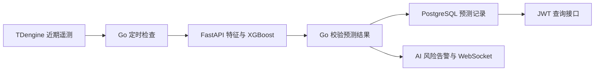

---
tags:
  - 源网智联
  - 开发阶段3
  - FastAPI
  - 告警
---

# 03 · 预测服务与告警

> 对应路线图第 11 周；阶段二已有告警与 JWT 语义继续复用。

## 一、数据流

Go 默认每五分钟从已登记且有新遥测的设备取最近 30 分钟电压、电流、温度、功率，调用本机 `POST /predict`。

- 训练与推理共用 `prediction.features.extract`，服务返回概率、模型版本、阈值和主要特征贡献。
- Go 只接受设备、窗口、概率及来源均合法的响应。

## 二、接口与持久化

| 接口或表 | 行为 |
| --- | --- |
| `POST /predict` | 本机 FastAPI；输入设备编号、窗口结束时间和原始点 |
| `GET /api/v1/devices/{id}/prediction` | JWT；输出最新概率、依据、模型版本和过期状态 |
| `prediction_records` | 按设备、窗口结束时间、模型版本唯一，重启重试不重复 |
| `alarm_records` | `metric=ai_failure_risk`，高风险创建、低风险恢复；确认状态沿用阶段二 |

边界与失效语义：

- 缺点、陈旧遥测或 AI 服务不可用时不生成新风险告警。
- 已有结果超过 15 分钟显示 `stale=true`。
- 预测告警的指标独立于温度规则，避免被遥测规则工作者误恢复。

## 相关笔记

- 上一章：[[02-特征与模型评估]]
- 下一章：[[04-M3测试与交付]]
- 上游接口：[[第一版-平台主体/架构设计/04-API接口设计]]
