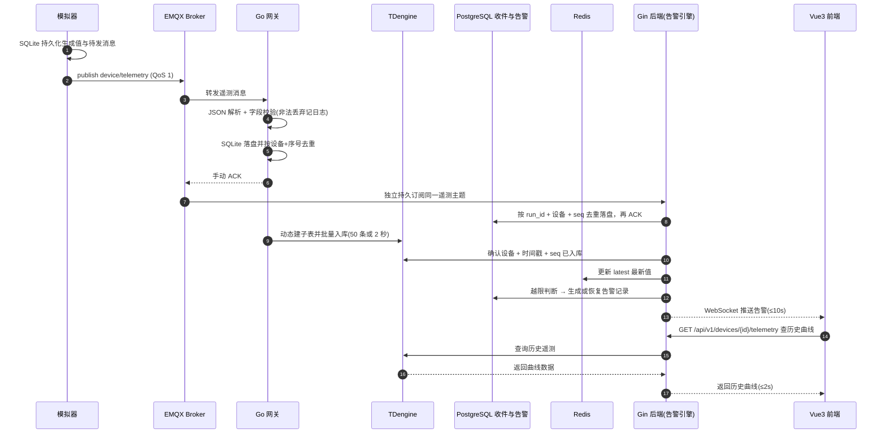

---
tags:
  - 架构设计
  - 数据流
  - 时序图
  - Mermaid
  - 源网智联
---

# 02 · 数据流设计

> 回到 [[00-索引·架构设计]]
> 对应手册任务 10（设计数据流——一条数据的奇幻漂流）

架构图是**静态结构**，数据流是**动态过程**。企业排查线上问题，靠的就是对数据流的完整理解：数据在哪一环断了、在哪一环变了形。本章以「逆变器上报一条温度数据」为主角，讲清它从产生到呈现在页面曲线上的每一步。

## 一、一条温度数据的完整旅程（11 步）

1. **设备产生**：逆变器模拟器按机理模型生成一条温度遥测（含时间戳、设备编号、温度值）。
2. **封装格式**：封装成 JSON（`{"device_id":"INV-1001","seq":0,"ts_ms":...,"temperature":...}`），先写模拟器 SQLite 账本与待发队列。
3. **发布**：通过 MQTT 发布到主题 `device/telemetry`（QoS1）。
4. **Broker 路由**：EMQX 接收并按主题路由，转发给订阅者。
5. **网关订阅接收**：Go 网关（paho 客户端）订阅该主题，收到消息。
6. **解析校验**：JSON 解析 + 字段校验（缺字段、类型错、超物理范围的丢弃并记日志）。
7. **持久化并确认**：合法数据先写入网关 SQLite，以设备+序号去重，再向 Broker 手动 ACK。
8. **批量写时序库**：合法数据攒 50 条或 2 秒刷一次，成功后清除待写队列。
9. **后端可靠收件**：Gin 服务独立持久订阅同一主题，写 PostgreSQL 收件表后 ACK；等待第 8 步的时序库入库确认。
10. **最新值与告警**：确认入库后更新 Redis；按规则新建、确认或恢复告警，并通过 WebSocket 推送。
11. **页面曲线更新**：历史曲线经 REST 查 TDengine；阶段二测试页接收 WebSocket，正式 Vue3 页面留待阶段四。

## 二、数据流时序图（Mermaid）

> 本图 PNG 存档见 `diagrams/dataflow.png`。

## 三、每一步「挂了会怎样」（容错设计）

| 环节 | 故障场景 | 系统表现 | 兜底设计 |
| --- | --- | --- | --- |
| 发布 | 模拟器连不上 Broker | 数据发不出 | 模拟器 SQLite 待发队列保留消息并重连 |
| Broker 路由 | EMQX 宕机 | 网关收不到消息 | 模拟器继续落盘；Broker 恢复后重发未确认消息 |
| 网关订阅 | 网关暂时断开 | 遥测暂时无法入库 | EMQX 持久会话保存未投递消息，网关恢复后续接 |
| 解析校验 | 收到畸形 JSON / 超范围值 | 脏数据污染库 | 校验不过直接丢弃 + 记日志 |
| 批量写库 | TDengine 重启 | 写失败 | 网关重试 + 未写入数据留在缓存队列，不丢 |
| 告警判断 | 规则匹配遗漏 | 漏报 | 规则引擎按设备+指标去重收敛，防重复告警 |
| WebSocket | 前端断连 | 收不到推送 | 前端自动重连 + 心跳；重连后拉取未读告警 |

## 四、回答手册三条验收问题

- **Q：Broker 宕机时数据去哪了？** → 模拟器先写本地 SQLite，Broker 不可用时保持在待发队列；确认成功后才移除。
- **Q：网关断网半小时恢复后数据丢不丢？** → 依赖 EMQX 持久会话保留未投递消息；网关已收到的数据在 SQLite 待写队列中，最终以逐条对账证明完整性，对应 NFR-04「完整率 ≥99.9%」。
- **Q：页面刷新为什么有延迟？** → 两条路径分工：实时数据走 WebSocket 主动推（无感更新），历史曲线走 REST 查 TDengine（需网络往返 + 查询，所以刷新后曲线「先空后现」）。这正是「实时走推送、历史走查询」的取舍。

## 五、落点

本数据流是 [[第一版-平台主体/需求分析/04-非功能需求清单]] NFR-03（告警 ≤10s）、NFR-04（完整率 ≥99.9%）、NFR-05（补传 30s）的架构兑现，也是手册第五章「最小闭环」阶段一（任务 14）的施工图。

## 六、第一版阶段五通知事件流

阶段五同时处理业务与运行监控。设备越限在步骤 10 的数据库事务中创建/恢复告警并写入唯一事件键；人工确认及 AI 高风险也写入同一持久投递表。Go API 后台从表中取待发事件，携内部令牌 POST 到飞书适配器；适配器签名并调用群机器人，成功后标记已送达，失败则退避重试。规则停用、删除或设备删除对应“配置关闭”，不得冒充遥测自然恢复。另一条监控链仍由 Prometheus → Alertmanager → 适配器处理 API 可用性和磁盘。旧 API 暂停/恢复群消息及新增业务链均已有现场证据；磁盘规则真实越限仍待专项测试。详见 [[第一版-平台主体/开发阶段5-飞书告警通知/01-链路与实现]]与[[第一版-平台主体/开发阶段5-飞书告警通知/03-阶段五测试与交付]]。

> 下一章：[[03-数据库设计]] — 数据流经过的每一步，数据最终落到哪、怎么存。

## 第二版数据流增量（v2.0.0 生效）

交互链路为页面 → JWT Go代理 → Redis限流租约 → Agent会话/知识/受限联网 → 六个只读工具 → Go业务数据 → 带引用回答。新会话不能绕过用户限额；取消、超时及错误释放租约，Redis异常只关闭问答接纳。

自动链路为原告警记录或监控Redis事件 → Go事件快照 → 独立异步解读 → 持久化结果 → WebSocket/两处建议面板。原告警确认、恢复与飞书投递不等待模型，模型不能改写概率或告警状态。数据时间、过期状态、审计及知识缺口随证据保留；备份采用既有加密目标，恢复使用隔离项目，不能向生产库回灌。契约见 [[第一版-平台主体/架构设计/04-API接口设计]]。

## 相关笔记

- 本模块索引：[[00-索引·架构设计]]
- 监控通知：[[第一版-平台主体/开发阶段5-飞书告警通知/00-索引·开发阶段5-飞书告警通知]]
