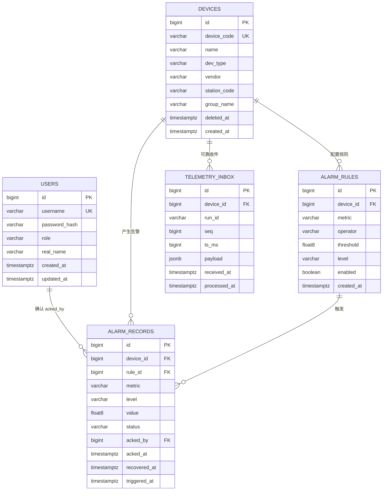

---
tags:
  - 架构设计
  - 数据库
  - ER图
  - PostgreSQL
  - TDengine
  - Mermaid
  - 源网智联
---

# 03 · 数据库设计

> 回到 [[00-索引·架构设计]]
> 对应手册任务 11（数据库设计：ER 图 + 建表 SQL + 时序库数据模型）

数据分两类、存两个库，各归其位（呼应 [[第一版-平台主体/技术选型/03-数据存储]]）：

> 本页前四节保留任务 11 的初版设计推导。阶段二已落地的字段、约束和动态子表以 `stages/02-backend/deploy/postgres/001_init.sql`、`stages/02-backend/deploy/tdengine/init.sql` 为准；原 `schema.sql` 是设计阶段草案，不能替代阶段二迁移脚本。

- **结构化业务数据**（用户、设备台账、告警规则/记录、工单）→ **PostgreSQL**，写少读多、关系明确；
- **高频遥测数据**（带时间戳、写多读少、海量）→ **TDengine**，写入吞吐与压缩率优先。

## 一、关系库 ER 图（Mermaid）



> 本图 PNG 存档见 `diagrams/er.png`。

## 二、表结构说明

命名规范：**小写下划线**（如 `alarm_records`）；业务主表有 `id`、`created_at`、`updated_at`，遥测收件表使用 `received_at`、`processed_at` 记录处理进度。

| 表 | 用途 | 关键字段 | 对应需求 |
| --- | --- | --- | --- |
| `users` | 账号与鉴权 | username（唯一）、password_hash（bcrypt）、role | FR-08 / NFR-06、07 |
| `devices` | 设备台账 | device_code（唯一，对齐时序库 tag）、station_code、group_name、deleted_at | FR-05 |
| `alarm_rules` | 告警规则 | device_id、metric、operator、threshold、level | FR-02、FR-03 |
| `alarm_records` | 告警记录 | device_id、rule_id、level、status、acked_by、recovered_at、triggered_at | FR-02、FR-04 |
| `telemetry_inbox` | 后端可靠收件 | run_id、device_id、seq、payload、processed_at | FR-02、FR-13 |

`work_orders` 属于 FR-14 Could 级预留，阶段二不建表。

> 关系：一个设备有多条告警记录（1—N）、一个设备配多条规则（1—N）、一条规则触发多条记录（1—N）、一条告警最多一个确认人。

## 三、时序库数据模型（TDengine）

TDengine 核心概念：**超级表（STABLE）** = 表结构模板；**tag** = 可索引标签（如设备编号）；**field** = 数值本身；**timestamp** = 主键。

```
超级表 telemetry：
  ts          TIMESTAMP    — 上报时间戳（主键）
  seq         BIGINT       — 模拟器序号，供完整性对账
  voltage     FLOAT        — 电压 V（field）
  current     FLOAT        — 电流 A（field）
  temperature FLOAT        — 温度 ℃（field）
  power       FLOAT        — 功率 kW（field）
  status      INT          — 运行状态（field）
  fault_code  INT          — 故障码（field）
TAGS：
  device_id   BINARY(64)   — 设备编号（tag）
  station_id  BINARY(64)   — 场站编号（tag）
```

**为什么 `device_id` 放 tag 不放 field？** 因为 tag 可索引、field 不可索引。历史曲线查询几乎总是「按设备查」（`WHERE device_id='INV-1001'`），device_id 放 tag 才能走索引、按设备快速过滤；若放 field，海量数据下逐条扫描会拖垮查询。

> 建表 SQL 见 `schema.sql`（设计脚本）。阶段一实际由 `stages/01-data-chain/deploy/tdengine/init.sql` 按运行编号创建独立数据库，见 [[第一版-平台主体/开发阶段1-数据链路/03-Go网关与时序入库]]。

## 四、初版建表 SQL（任务 11 草案）

初版脚本保存在 `schema.sql` 供设计追溯；阶段二运行使用各服务目录下的实际迁移脚本，不能把此混合脚本直接当成部署命令。

### 第一段 · PostgreSQL 关系库 DDL

```sql
-- ============================================================
-- ① PostgreSQL 关系库（业务数据：用户 / 设备 / 告警 / 工单）
-- ============================================================

-- 用户表（FR-08 登录鉴权，密码 bcrypt 加密，不存明文）
CREATE TABLE IF NOT EXISTS users (
    id            BIGSERIAL PRIMARY KEY,
    username      VARCHAR(64)  NOT NULL UNIQUE,
    password_hash VARCHAR(255) NOT NULL,
    role          VARCHAR(32)  NOT NULL DEFAULT 'operator',
    real_name     VARCHAR(64),
    created_at    TIMESTAMPTZ  NOT NULL DEFAULT now(),
    updated_at    TIMESTAMPTZ  NOT NULL DEFAULT now()
);

-- 设备表（FR-05 台账；device_code 与 MQTT 主题 / 时序库 tag 对齐）
CREATE TABLE IF NOT EXISTS devices (
    id          BIGSERIAL PRIMARY KEY,
    device_code VARCHAR(64)  NOT NULL UNIQUE,
    name        VARCHAR(128) NOT NULL,
    dev_type    VARCHAR(32)  NOT NULL,
    vendor      VARCHAR(64),
    station_id  BIGINT,
    group_name  VARCHAR(64),
    status      VARCHAR(32)  NOT NULL DEFAULT 'offline',
    created_at  TIMESTAMPTZ  NOT NULL DEFAULT now(),
    updated_at  TIMESTAMPTZ  NOT NULL DEFAULT now()
);
CREATE INDEX IF NOT EXISTS idx_devices_group ON devices (group_name);

-- 告警规则表（FR-02/03 越限判断依据）
CREATE TABLE IF NOT EXISTS alarm_rules (
    id         BIGSERIAL PRIMARY KEY,
    device_id  BIGINT             NOT NULL REFERENCES devices (id) ON DELETE CASCADE,
    metric     VARCHAR(32)        NOT NULL,
    operator   VARCHAR(8)         NOT NULL,
    threshold  DOUBLE PRECISION   NOT NULL,
    level      VARCHAR(16)        NOT NULL DEFAULT 'major',
    enabled    BOOLEAN            NOT NULL DEFAULT true,
    created_at TIMESTAMPTZ        NOT NULL DEFAULT now(),
    updated_at TIMESTAMPTZ        NOT NULL DEFAULT now()
);

-- 告警记录表（FR-02/04 告警闭环）
CREATE TABLE IF NOT EXISTS alarm_records (
    id           BIGSERIAL PRIMARY KEY,
    device_id    BIGINT       NOT NULL REFERENCES devices (id) ON DELETE CASCADE,
    rule_id      BIGINT       REFERENCES alarm_rules (id),
    metric       VARCHAR(32)  NOT NULL,
    level        VARCHAR(16)  NOT NULL,
    value        DOUBLE PRECISION,
    threshold    DOUBLE PRECISION,
    status       VARCHAR(16)  NOT NULL DEFAULT 'unhandled',
    acked_by     BIGINT       REFERENCES users (id),
    acked_at     TIMESTAMPTZ,
    triggered_at TIMESTAMPTZ  NOT NULL DEFAULT now(),
    created_at   TIMESTAMPTZ  NOT NULL DEFAULT now(),
    updated_at   TIMESTAMPTZ  NOT NULL DEFAULT now()
);
CREATE INDEX IF NOT EXISTS idx_alarm_device_status ON alarm_records (device_id, status);
CREATE INDEX IF NOT EXISTS idx_alarm_status_time   ON alarm_records (status, triggered_at DESC);

-- 工单表（FR-14 Could，预留）
CREATE TABLE IF NOT EXISTS work_orders (
    id         BIGSERIAL PRIMARY KEY,
    device_id  BIGINT       REFERENCES devices (id) ON DELETE SET NULL,
    alarm_id   BIGINT       REFERENCES alarm_records (id),
    title      VARCHAR(128) NOT NULL,
    status     VARCHAR(16)  NOT NULL DEFAULT 'open',
    assignee   BIGINT       REFERENCES users (id),
    created_at TIMESTAMPTZ  NOT NULL DEFAULT now(),
    updated_at TIMESTAMPTZ  NOT NULL DEFAULT now()
);
```

### 第二段 · TDengine 时序库 DDL

```sql
-- ============================================================
-- ② TDengine 时序库（遥测数据：写多读少、海量、带时间戳）
-- ============================================================

-- 1) 建库：遥测保留 365 天
CREATE DATABASE IF NOT EXISTS powersystem PRECISION 'ms' KEEP 365 DURATION 10;

-- 2) 超级表：设备遥测
--    tag   = 设备/场站编号（可索引，按设备快速查询）
--    field = 指标数值（不可索引）
USE powersystem;

CREATE STABLE IF NOT EXISTS telemetry (
    ts          TIMESTAMP,
    seq         BIGINT,
    voltage     FLOAT,
    current     FLOAT,
    temperature FLOAT,
    power       FLOAT,
    status      INT,
    fault_code  INT
) TAGS (
    device_id   BINARY(64),
    station_id  BINARY(64)
);

-- 3) 每台设备一张子表（device_id 进 tag，实现按设备检索 + 索引）
CREATE TABLE IF NOT EXISTS t_inv_1001 USING telemetry TAGS ('INV-1001', 'ST-01');
CREATE TABLE IF NOT EXISTS t_inv_1002 USING telemetry TAGS ('INV-1002', 'ST-01');
CREATE TABLE IF NOT EXISTS t_inv_1003 USING telemetry TAGS ('INV-1003', 'ST-01');
```

## 五、验收自检（任务 11 标准）

- [x] 每条功能需求需要的数据都有表可存（FR-01~FR-13 均有对应表/字段）；
- [x] 能说出为什么 `device_id` 放 tag 而不是 field（按设备快速查询 + 索引）。

> 下一章：[[04-API接口设计]] — 数据存好了，前端怎么通过接口取到它。

## 六、阶段二落地修订

| 对象 | 与初版草案的差异 | 原因 |
| --- | --- | --- |
| `devices` | 场站字段改为 `station_code VARCHAR(64)`；增加 `deleted_at` | 与 MQTT `station_id` 字符编号对齐；软删除保留历史 |
| `alarm_rules` | `(device_id, metric)` 唯一；删除规则时历史记录的 `rule_id` 可置空 | 每设备每指标一条当前规则，同时保留告警历史 |
| `alarm_records` | 增加 `recovered_at`，未恢复的 `(device_id, metric)` 部分唯一 | 确认后持续越限不重报，恢复后再允许新告警 |
| `telemetry_inbox` | 新增 `(run_id, device_id, seq)` 唯一收件表及 `processed_at` | 后端持久订阅去重，等待 TDengine 入库后再评估 |
| TDengine | 长期库 `powersystem_stage2`、超级表 `telemetry`；子表 `t_device_<数据库数字 ID>` 动态创建 | 新设备登记后即可接入，阶段一验收库不受影响 |

阶段二 API、网关与测试统一使用这些落地字段；详见 [[第一版-平台主体/开发阶段2-后端主体/01-结构与数据库落地]]。

## 7、第一版阶段五业务通知投递表

运行迁移 `stages/02-backend/deploy/postgres/004_business_notifications.sql` 新增 `business_notification_outbox`。

- `event_key`：在告警 ID 与状态变化上唯一。
- `payload`：保存脱敏的设备、场站、级别、指标与时间。
- `attempts`、`next_attempt_at`、`sent_at`：支持失败退避和追溯。
- 告警记录与待发送任务同事务提交，备份 PostgreSQL 时一起保存。
- 网络确认不确定时可能重复送达，消息中含事件 ID 供人工辨认。

## 相关笔记

- 本模块索引：[[00-索引·架构设计]]
