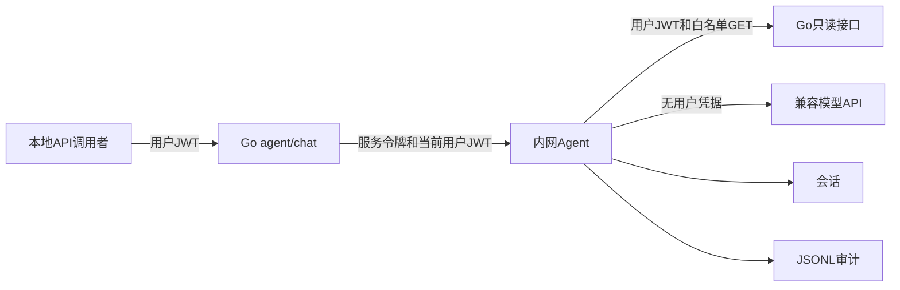

---
tags:
  - 源网智联
  - 第二版
  - 智能体
  - 阶段一
  - 设计
---

# 01 · 阶段一方案设计 · 基础服务与只读工具链

> 本页为 V2-T01～T04 的实施基线，已按代码核对和项目所有者确认修订。目标是本地 API 闭环；当前实际测试与待验项见正式测试交付页。

## 一、可行性与关键决策

| 决策 | 实施方案 |
| --- | --- |
| 服务形态 | 独立 FastAPI，源码 `stages/07-agent/` |
| 模型 | 自行配置兼容 API，必须支持原生工具调用 |
| 取数 | 固定白名单 GET，通过 Go API，不直连业务库 |
| 身份 | 当前用户 JWT，不使用统一取数账号 |
| 会话 | Redis，用户隔离，TTL 24 小时，最近 10 轮 |
| 审计 | JSONL，脱敏，进入 `artifacts/stage7-智能体/` |
| 第一阶段交付 | 本地服务与 API，不开发页面或部署服务器 |

数据、预测与接口已存在，轻量服务可行。但代码没有逐用户设备授权，告警列表原来没有设备及时间筛选；方案不能将设计意向写成既有能力。阶段一已补查询筛选，沿用实际角色权限。

## 二、鉴权链路与边界

- Go 从认证上下文确定 `user_id`，外部请求只允许 `message` 与可选 `session_id`。
- 已登录用户可读全部演示设备；admin/operator 角色仍由 Go 校验，逐设备授权不在 V2-M1。
- 工具不确认告警、不自动建工单、不远控；建议须人工确认。
- Agent 不持有 JWT 签名密钥，不把用户 JWT 传给模型或写入会话／日志。

## 三、工具与回答

六个工具：设备列表、最新／历史遥测、预测、告警列表、告警详情、总览汇总。

- 新增 `keyword` 设备筛选及 `device_id/start/end` 告警筛选，原接口默认行为兼容。
- 分页默认 20、上限 100；历史最长 24 小时、后端上限 5000 点；模型输入最多 100 个真实点并附统计，标明分页与压缩。
- 最新遥测 15 秒、预测 15 分钟过期；数据不足、过期或不可用时明确无法判断。
- 回答为 `conclusion/evidence/suggestions/limitations`；证据由工具产生，模型只能引用本轮成功证据编号。
- 模型概率、阈值与来源保留原值；数字与引用校验不能代替真实模型回答质量抽查。

## 四、限额、异常与部署

- 最多 5 轮工具调用、10 次工具执行；工具 5 秒，模型每次 20 秒，Agent 总期限 40 秒，Go 代理 45 秒。
- 客户端取消传递到下游，取消请求记录审计并释放会话锁。
- 模型问题明确降级；Redis与审计不可用明确失败。Go业务启动和告警链路不依赖Agent。
- 本地只绑定回环，提供 PowerShell 与独立 Compose；统一服务器编排为可选 overlay，尚未部署。
- 第二阶段设备与预测事件可复用WebSocket，但平台监控当前只进入Alertmanager→飞书，仍需独立接入。
- 仅预留第二阶段解读接口方向，不注册空实现。

## 五、验收与证据

离线测试、本地 Go／Redis 联调、真实模型 API 联调全部通过且证据齐全，才能签收 V2-M1。模拟器仅验证协议，不是 LLM 验收；服务器 ping 不等于业务全链路验收。

> 当前三类证据均已齐全，V2-M1 本机合成演示范围验收通过。正式结论见 [[05-V2-M1测试与交付]]，产物进入被忽略的 `artifacts/stage7-智能体/<运行编号>/`。

## 相关笔记

- 上游：[[第二版-智能体升级/01-智能体需求与可行性]]
- 阶段索引：[[00-索引·基础服务与只读工具链]]
- 下一章：[[02-Agent服务与模型接入]]
- 边界：[[第一版-平台主体/开发阶段3-AI预测模块/05-智能体接口设计]]
- 运行：[[stages/07-agent/README]]
- 规范：[[项目工程规范]]
