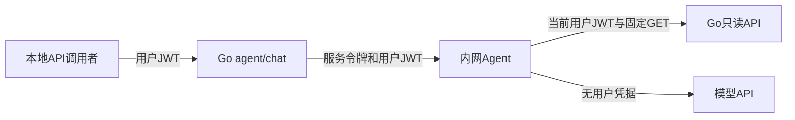

---
tags:
  - 源网智联
  - 第二版
  - 智能体
  - 阶段一
  - 鉴权
---

# 03 · 只读工具与鉴权链路

> 对应 V2-T02～T03。依据已核对的 Go 实现修正权限表述，保证智能体取数沿用当前用户身份。

## 一、身份链路

- Go 从认证上下文取得 `user_id`，拒绝客户端伪造身份字段，用户 JWT 不进入模型、Redis或审计。
- 当前 Go 仅有 admin/operator 角色权限；已登录账号均可查全部演示设备。后续如需逐场站授权，应统一改 Go 查询与推送，不能在提示词里过滤。
- Agent 无业务数据库凭据；没有写工具、任意 URL 工具或自动建工单能力。

## 二、工具与参数

| 工具 | 对应接口 |
| --- | --- |
| `list_devices` | `/api/v1/devices` |
| `get_telemetry` | `/devices/:id/telemetry` 及 `/latest` |
| `get_prediction` | `/devices/:id/prediction` |
| `list_alarms` | `/api/v1/alarms` |
| `get_alarm_detail` | `/api/v1/alarms/:id` |
| `get_dashboard_summary` | `/api/v1/dashboard/summary` |

以上设备子路径均位于 `/api/v1`。列表支持分页 1 起、每页 20、上限 100；禁止额外参数和布尔值冒充设备 ID。

- 设备 `group_name` 精确筛选，`keyword` 查询名称或编码，使用参数化 SQL。
- 告警 `device_id/status/level/start/end` 可选；时间依据 `triggered_at`，RFC3339，起止均包含。
- 历史遥测要求指标和起止时间，最长 24 小时，后端最多 5000 点；模型最多接收 100 个实际点和完整窗口统计。
- 最新遥测按 `received_at` 15 秒标记过期；预测沿用后端 `stale`（15 分钟）。空、过期、不可用结果不支持当前状态判断。

## 三、回答与证据

- 结论、证据、建议为结构化字段；证据编号、时间、来源和数据由工具执行器生成。
- 模型只能引用本轮成功证据；历史会话不能代替本轮工具调用。
- 结构、引用和数字不符时降级；预测保留概率、阈值、来源和模型版本。
- 数值校验包含证据元数据中的来源、查询与采集时间，支持等价 UTC 秒级表达；避免正确引用本轮时间被误拒绝，仍拒绝概率改写与无依据年份。
- 分页不完整、曲线压缩与汇总查询时间均明确标记，处置建议附人工确认。

> 数字与引用校验是机械检查，不能证明自然语言根因分析正确。真实模型回答仍需人工抽查；工具数据与用户输入均不可信，提示注入的执行边界由工具白名单与只读 HTTP 保证。

## 相关笔记

- 上一章：[[02-Agent服务与模型接入]]
- 下一章：[[04-会话审计与本地联调]]
- 继承边界：[[第一版-平台主体/开发阶段3-AI预测模块/05-智能体接口设计]]
- 验收：[[05-V2-M1测试与交付]]
