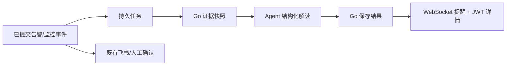

---
tags:
  - 源网智联
  - 第二版
  - 智能体
  - 阶段二
  - 设计
---

# 01 · 阶段二方案设计 · 告警智能解读与大屏联动

> 对应 V2-T05～T07。本页记录实施前确定的职责、身份和故障边界；源码事实见后续专题，测试与服务器状态见 [[05-V2-M2测试与交付]]。

## 一、目标与可行性

第一版已经具备三类输入基础：设备越限写入告警表、AI 风险形成预测与告警、平台监控由 Alertmanager 管理。V2-M2 在现有 Go、Agent、Redis、PostgreSQL、Vue 与统一 Compose 上增量实现，不增加消息中间件或第二套用户体系。

- **V2-T05**：已提交事件进入独立任务，不让模型调用进入原告警事务。
- **V2-T06**：总览自动展示活动解读，其他页面提供统一入口。
- **V2-T07**：结论与建议可以展开触发时证据，并回到既有业务页面。

## 二、关键设计决策

### 2.1 自动解读使用受限事件取证

| 场景 | 身份 | 权限边界 |
| --- | --- | --- |
| 用户问答 | 当前用户 JWT | 经 Go 只读接口取数 |
| 自动解读 | 独立服务凭据＋事件证据包 | Agent 不查询业务库 |
| 人工确认 | 当前用户 JWT | 复用既有告警确认接口 |

无人登录时不存在“当前用户 JWT”。自动任务因此不能借用管理员会话或长期用户令牌；Go 在业务权限域内固定触发事实，Agent 只解释传入证据。

### 2.2 解读链路不成为告警依赖

Agent、模型或解读存储故障只影响附加解释。原告警、飞书与人工确认继续运行；Go 暂停时，平台监控先进入 Redis Stream 等待持久化。

### 2.3 模型不可用是正式状态

- 未配置、认证失败或明确无额度时不反复调用供应商。
- 限流、网络和 5xx 只做有限重试；普通 429 不等同于额度耗尽。
- 格式、引用或数字非法时拒绝整条回答，不拼接“看似可用”的结论。
- 管理员检测成功后，只补最近 24 小时仍活动的永久降级事件。

## 三、默认参数

| 项目 | 约定 |
| --- | --- |
| 首次启用 | 建立基线，不批量处理历史告警 |
| 并发与租约 | 2 个工作协程，60 秒租约 |
| 暂时故障 | 最多 3 次；间隔 5 秒、30 秒 |
| 时间预算 | 模型 20 秒、Agent 40 秒、Go 45 秒 |
| 业务告警 | 沿用人工确认 |
| 平台监控 | 只记录当前用户已读 |

> 关闭面板不等于确认；模型建议必须注明人工确认。自动处置、远控和建工单仍不在范围内。

## 四、验收门槛

阶段完成必须同时满足：三类真实模型解读、本机故障隔离、模型缺失/过期/额度/限流降级、公网与飞书回归、备份恢复、实际回退，以及不少于 30 分钟的上线观察。协议模拟器只证明工程处理，不替代真实模型成功解读。

## 相关笔记

- 上游：[[第二版-智能体升级/01-智能体需求与可行性]]
- 下一章：[[02-异步解读与事件取证]]
- 索引：[[00-索引·告警智能解读与大屏联动]]
- 第一版接口边界：[[第一版-平台主体/开发阶段3-AI预测模块/05-智能体接口设计]]
