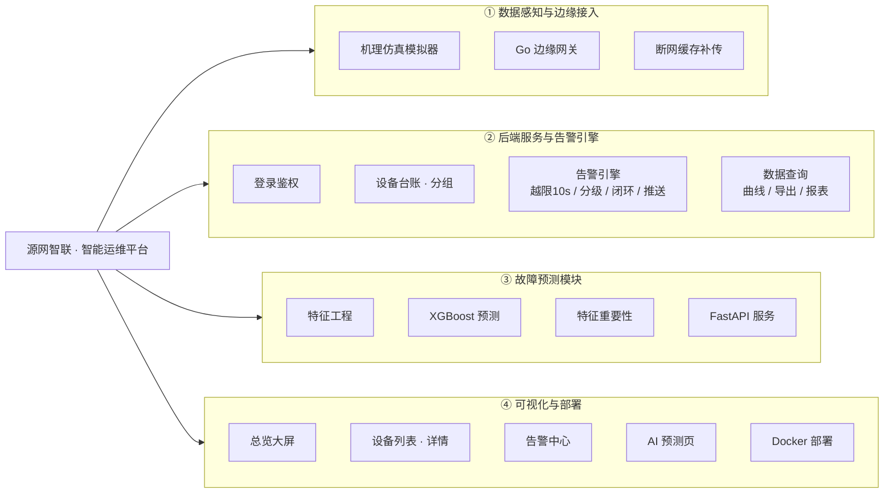

---
tags:
  - 功能结构图
  - Mermaid
  - 需求分析
  - 源网智联
---

# 05 · 功能结构图

> 回到 [[00-索引·需求分析]]

本章把 [[03-功能需求清单]] 画成一棵**树状功能结构图**：根节点是系统名，第一层是功能模块，往下逐级展开到具体功能点。对应手册任务 7。

**检查标准**：每条 Must 级需求都能在图上找到位置；图上每个叶子节点都能对应回某条需求。两边对不上，说明清单或图有一个漏了。

> 排版说明：采用**横向（LR）+ 四子图并列**布局，四大子系统横排、功能点纵向展开，避免纵向拉太长，可在一个屏幕内看完。若 Obsidian 阅读视图下仍偏宽，可缩放页面或切换到「阅读模式」查看。

## 一、功能结构图（Mermaid）

## 二、文字对照表（功能 ↔ 需求）

| 图上节点 | 对应功能需求 | 说明 |
| --- | --- | --- |
| ① 数据感知与边缘接入 | FR-01、FR-13 | 模拟器 + 网关接入 + 断网补传 |
| ② 登录鉴权 | FR-08 | JWT |
| ② 设备台账 · 分组 | FR-05 | 增删改查 + 分组 |
| ② 告警引擎（越限/分级/闭环/推送） | FR-02、FR-03、FR-04 | 告警全闭环 |
| ② 数据查询（曲线/导出/报表） | FR-06、FR-11、FR-12 | 数据消费侧 |
| ③ 故障预测模块 | FR-09 | XGBoost + 特征重要性 |
| ④ 总览大屏 | FR-07 | 全场站关键指标 |
| 工单管理 | FR-14（Could） | 图上未展开，属加分项 |
| 数字孪生 / LSTM 对照 | FR-15、FR-16（Could） | 未来工作 |

## 三、覆盖核对结论

- **Must 级 9 条**（FR-01 ~ FR-08、FR-13）全部在图上找到位置 ✅
- **Should 级 4 条**（FR-09 ~ FR-12）全部在图上 ✅
- **Could 级 3 条**（FR-14 ~ FR-16）中工单管理在告警闭环侧预留扩展，数字孪生与 LSTM 对照属「未来工作」，不在 MVP 树内，符合 MoSCoW 砍减原则 ✅
- 图上叶子节点均能对应回某条 FR，无「悬空」节点 ✅

---

> 需求分析模块到此完成。四个任务（画像 → 故事 → 功能/非功能需求 → 结构图）全部交付。
>
> 下一步：进入**技术选型**（手册第三章，任务 8，见 [[技术选型/00-索引·技术选型]]），把功能需求逐层翻译成技术选型对比表。

## 相关笔记

- 本模块索引：[[00-索引·需求分析]]
